# Docker的概述
## Docker能做什么
>之前的虚拟机技术


虚拟机技术的缺点：

1. 资源占用十分多
2. 冗余步骤多
3. 启动很慢

> 容器化技术

==容器化技术不是模拟的一个完整的操作系统==

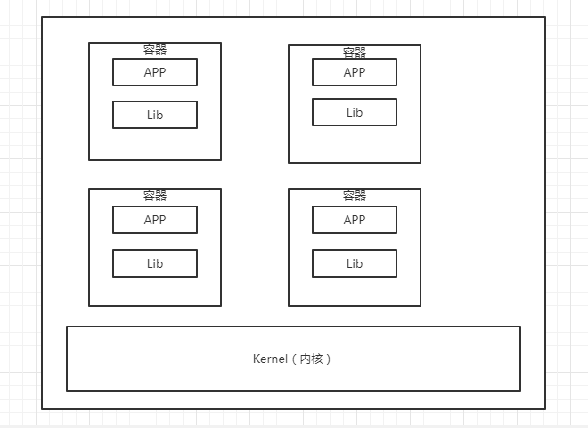

比较Docker和虚拟机技术的不同：

- 传统虚拟机，虚拟出一个硬件条件，运行一个完整的操作系统，然后再这个系统上安装和运行软件
- 容器内的应用直接运行在宿主机的内核上，容器是没有自己的内核的，也没有虚拟的硬件，所以就轻便了。
- 每个容器之间是相互隔离的，每个容器内都有自己的文件系统，互不影响

>DevOps(开发，运维)

**更快速的交付和部署**

传统：一堆帮助文档，安装程序

Docker：打包镜像发布测试，一键运行

**更便捷的升级和扩容**

使用Docker之后，我们部署应用就和搭积木一样

项目打包为一个镜像，扩展服务器A，服务器B

**更简单的系统运维**

在容器化之后，我们的开发，测试环境都是高度一致的。

**更高效的计算资源利用**

Docker是内核级别的虚拟化，可以在一个物理机上运行很多的容器实例。服务器的性能可以被压榨到极致。

# Docker的安装

## Docker的基本组成

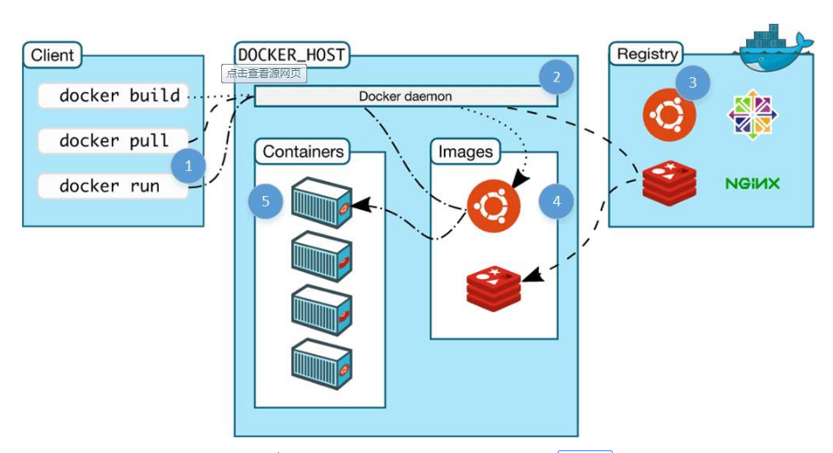

**镜像（image）：**

docker镜像就好比是一个模板，可以通过这个模板来创建容器服务，tomcat镜像==》run ==》tomcat01容器（提供服务）

通过这个镜像可以创建多个容器（最终服务运行或者项目运行就是在容器中）。

**容器（container）**

Docker利用容器技术，独立运行一个或者一组应用，通过镜像来创建

启动，停止，删除，基本命令！

**仓库（repository）**

仓库就是存放镜像的地方

仓库分为共有仓库和私有仓库

Docker Hub（国外的镜像仓库）

阿里云。。。都有容易服务器（配置镜像加速）

## 安装Docker

> 系统查看

```shell
# 系统内核是3.0以上
[root@iZm5e74mdg5903trjt1e17Z ~]# uname -r
3.10.0-862.14.4.el7.x86_64
```

```shell
# 系统版本
[root@iZm5e74mdg5903trjt1e17Z ~]# cat /etc/os-release 
NAME="CentOS Linux"
VERSION="7 (Core)"
ID="centos"
ID_LIKE="rhel fedora"
VERSION_ID="7"
PRETTY_NAME="CentOS Linux 7 (Core)"
ANSI_COLOR="0;31"
CPE_NAME="cpe:/o:centos:centos:7"
HOME_URL="https://www.centos.org/"
BUG_REPORT_URL="https://bugs.centos.org/"

CENTOS_MANTISBT_PROJECT="CentOS-7"
CENTOS_MANTISBT_PROJECT_VERSION="7"
REDHAT_SUPPORT_PRODUCT="centos"
REDHAT_SUPPORT_PRODUCT_VERSION="7"
```

> 安装

```shell
#1.卸载旧的版本
yum remove docker \
                  docker-client \
                  docker-client-latest \
                  docker-common \
                  docker-latest \
                  docker-latest-logrotate \
                  docker-logrotate \
                  docker-engine
                  
#2.需要的安装包
yum install -y yum-utils

#3.设置镜像的仓库
yum-config-manager \
    --add-repo \
    https://download.docker.com/linux/centos/docker-ce.repo ##国外的仓库地址，十分慢
    
yum-config-manager \
    --add-repo \
    http://mirrors.aliyun.com/docker-ce/linux/centos/docker-ce.repo ## 阿里云的镜像仓库
    
#更新yum软件包的索引
yum makecache fast

#4.安装docker相关的配置  docker-ce  社区版 ee 企业版
yum install docker-ce docker-ce-cli containerd.io

#5.启动docker
systemctl start docker

#6.使用 docker version 确认是否安装成功

#7.测试docker hello world
[root@iZm5e74mdg5903trjt1e17Z ~]# docker run hello-world
Unable to find image 'hello-world:latest' locally   ##未找到hello-world的镜像
latest: Pulling from library/hello-world  ##远程拉取镜像
0e03bdcc26d7: Pull complete 
Digest: sha256:49a1c8800c94df04e9658809b006fd8a686cab8028d33cfba2cc049724254202
Status: Downloaded newer image for hello-world:latest  ##拉取成功，并下载新的镜像

Hello from Docker!  ##代表安装成功了
This message shows that your installation appears to be working correctly.

To generate this message, Docker took the following steps:
 1. The Docker client contacted the Docker daemon.
 2. The Docker daemon pulled the "hello-world" image from the Docker Hub.
    (amd64)
 3. The Docker daemon created a new container from that image which runs the
    executable that produces the output you are currently reading.
 4. The Docker daemon streamed that output to the Docker client, which sent it
    to your terminal.

To try something more ambitious, you can run an Ubuntu container with:
 $ docker run -it ubuntu bash

Share images, automate workflows, and more with a free Docker ID:
 https://hub.docker.com/

For more examples and ideas, visit:
 https://docs.docker.com/get-started/


#8.查看下载的hello-world镜像
[root@iZm5e74mdg5903trjt1e17Z ~]# docker images
REPOSITORY          TAG                 IMAGE ID            CREATED             SIZE
httpd               latest              b2c2ab6dcf2e        3 months ago        166MB
ubuntu              latest              4e5021d210f6        4 months ago        64.2MB
hello-world         latest              bf756fb1ae65        7 months ago        13.3kB
ubuntu              15.10               9b9cb95443b5        4 years ago         137MB
training/webapp     latest              6fae60ef3446        5 years ago         349MB
ubuntu              13.10               7f020f7bf345        6 years ago         185MB
```

了解：卸载docker

```shell
#1.移除安装的东西
yum remove docker-ce docker-ce-cli containerd.io

#2.删除本地的docker资源
rm -rf /var/lib/docker
```

## 阿里云镜像加速

1. 登录阿里云，找到容器镜像服务

2. 找到镜像加速

3. 配置使用镜像加速

   ```shell
   sudo mkdir -p /etc/docker
   sudo tee /etc/docker/daemon.json <<-'EOF'
   {
     "registry-mirrors": ["https://o3pt37gd.mirror.aliyuncs.com"]
   }
   EOF
   sudo systemctl daemon-reload
   sudo systemctl restart docker
   ```

## 回顾HelloWorld流程

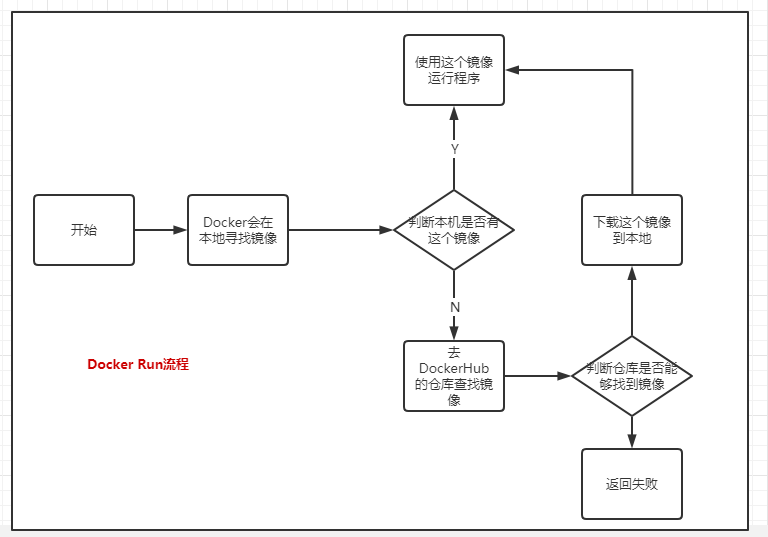

## 底层原理

**Docker是怎么工作的？**

Docker是一个Client-Server结构的系统，Docker的守护进程运行在宿主机上，通过Socket从客户端访问！

DockerServer接收到DockerClient的指令，就会执行这个指令！


**Docker为什么比VM快**

1. Docker有着比虚拟机更少的抽象层
2. docker利用的是宿主机的内核，VM需要的是Guest OS
3. 新建一个容器的时候，docker不需要像虚拟机一样重新加载一个操作系统内核，避免引到。
4. 虚拟机是加载Guest OS，时间是分钟级别的。docker是利用宿主机的操作系统，省略的复杂的过程是，时间是秒级别的。

# Docker的常用命令

## 帮助命令

```shell
docker version  	# 显示docker的版本信息
docker info			# 显示docker的系统信息  包括镜像和容器的数量
docker 命令 --help   # 帮助命令
```

**帮助文档的地址：https://docs.docker.com/reference/**

## 镜像命令

**docker images 查看所有本地的主机上的镜像**

```shell
[root@iZm5e74mdg5903trjt1e17Z ~]# docker images
REPOSITORY          TAG                 IMAGE ID            CREATED             SIZE
httpd               latest              b2c2ab6dcf2e        3 months ago        166MB
ubuntu              latest              4e5021d210f6        4 months ago        64.2MB
hello-world         latest              bf756fb1ae65        7 months ago        13.3kB
ubuntu              15.10               9b9cb95443b5        4 years ago         137MB
training/webapp     latest              6fae60ef3446        5 years ago         349MB
ubuntu              13.10               7f020f7bf345        6 years ago         185MB
# 解释
REPOSITORY	镜像的仓库源
TAG			镜像的标签
IMAGE ID	镜像的id
CREATED		镜像的创建时间
SIZE		镜像的大小

# 可选项
Options:
  -a, --all             # 列出全部的镜像
  -f, --filter filter   # 根据所提供的条件过滤输出
      --format string   # 使用Go模板的漂亮打印图像
      --no-trunc        # 不截断输出
  -q, --quiet           # 只显示镜像的id
```

**docker search 搜索镜像**

```shell
[root@iZm5e74mdg5903trjt1e17Z ~]# docker search mysql
NAME                              DESCRIPTION                                     STARS               OFFICIAL            AUTOMATED
mysql                             MySQL is a widely used, open-source relation…   9834                [OK]                
mariadb                           MariaDB is a community-developed fork of MyS…   3589                [OK]                

# 可选项
--filter=STARS=3000		#搜索stars不小于3000的镜像
```

**docker pull 下载镜像**

```shell
[root@iZm5e74mdg5903trjt1e17Z ~]# docker pull mysql
Using default tag: latest		#如果不写tag  则默认是latest
latest: Pulling from library/mysql
bf5952930446: Pull complete 	#分层下载，docker image的核心  联合文件系统
8254623a9871: Pull complete 
938e3e06dac4: Pull complete 
ea28ebf28884: Pull complete 
f3cef38785c2: Pull complete 
894f9792565a: Pull complete 
1d8a57523420: Pull complete 
6c676912929f: Pull complete 
ff39fdb566b4: Pull complete 
fff872988aba: Pull complete 
4d34e365ae68: Pull complete 
7886ee20621e: Pull complete 
Digest: sha256:c358e72e100ab493a0304bda35e6f239db2ec8c9bb836d8a427ac34307d074ed	#签名
Status: Downloaded newer image for mysql:latest
docker.io/library/mysql:latest		#真实地址

# 等价命令
docker pull mysql
docker pull docker.io/library/mysql:latest

# 通过制定版本下载
[root@iZm5e74mdg5903trjt1e17Z ~]# docker pull mysql:5.7
5.7: Pulling from library/mysql
bf5952930446: Already exists 	#之前下载了mysql的最新版本，部分的文件和5.7版本是共用的
8254623a9871: Already exists 	#所以不需要再下载
938e3e06dac4: Already exists 
ea28ebf28884: Already exists 
f3cef38785c2: Already exists 
894f9792565a: Already exists 
1d8a57523420: Already exists 
5f09bf1d31c1: Pull complete 
1b6ff254abe7: Pull complete 
74310a0bf42d: Pull complete 
d398726627fd: Pull complete 
Digest: sha256:da58f943b94721d46e87d5de208dc07302a8b13e638cd1d24285d222376d6d84
Status: Downloaded newer image for mysql:5.7
docker.io/library/mysql:5.7

```

**docker rmi 删除镜像**

```shell
# 根据image id 删除镜像
[root@iZm5e74mdg5903trjt1e17Z ~]# docker rmi -f 镜像id
# 根据image id 删除多个镜像
[root@iZm5e74mdg5903trjt1e17Z ~]# docker rmi -f 镜像id 镜像id  镜像id
# 删除全部的镜像
[root@iZm5e74mdg5903trjt1e17Z ~]# docker rmi -f $(docker images -aq)


```


##  容器命令

说明：有了镜像之后才能够创建容器，Linux ，下载一个CentOS测试

```shell
[root@iZm5e74mdg5903trjt1e17Z ~]# docker pull centos
Using default tag: latest
latest: Pulling from library/centos
3c72a8ed6814: Pull complete 
Digest: sha256:76d24f3ba3317fa945743bb3746fbaf3a0b752f10b10376960de01da70685fbd
Status: Downloaded newer image for centos:latest
docker.io/library/centos:latest
```

**docker run 新建容器并启动**

```shell
docker run [OPTIONS] IMAGE [COMMAND] [ARG...]

# 参数说明
--name="Name"	容器的名字 tomcat1 Tomcat2   用来区分容器
-d				后台运行
-it				使用交互方式运行，进入容器查看内容
-p				指定容器的端口	8080：8080
	-p	ip：主机端口:容器端口（主机的ip）
	-p	主机端口：容器端口（常用）
	-p	容器端口
	容器端口
-P				大写的P，随机指定端口


# 测试  启动并进入容器
[root@iZm5e74mdg5903trjt1e17Z ~]# docker run -it centos /bin/bash
[root@0880709d8f75 /]# 
[root@0880709d8f75 /]# ls		#查看容器内的centos，基础版本，很多的命令都不是完善的
bin  dev  etc  home  lib  lib64  lost+found  media  mnt  opt  proc  root  run  sbin  srv  sys  tmp  usr  var
[root@0880709d8f75 /]# exit		#退出容器
exit


```

**docker ps 列出所有的运行的容器**

```shell
[root@iZm5e74mdg5903trjt1e17Z ~]# docker ps
[root@iZm5e74mdg5903trjt1e17Z ~]# docker ps -a
# docker ps   列出当前正在运行的容器
-a			#列出当前正在运行的容器+带出历史运行过的容器
-n=?		#显示最近创建的容器
-q			#只显示容器的编号
```

**exit 退出容器**

```shell
exit	#容器直接停止并退出
Ctrl + P + Q #容器不停止退出
```

**docker rm 删除容器**

```shell
docker rm 容器id						#删除指定容器，不能删除正在运行的容器
docker rm -f $(docker ps -aq)	 	#删除所有容器
docker ps -a -q | xargs docker rm	#删除所有容器
```

**启动和停止容器的操作**

```shell
docker start 容器id		# 启动容器
docker restart 容器id		# 重启容器
docker stop 容器id		# 停止容器
docker kill 容器id		# 强制停止当前容器
```

## 常用的其他命令

**后台启动命令**

```shell
# 命令docker run -d 镜像名
[root@iZm5e74mdg5903trjt1e17Z ~]# docker run -d centos

# 问题 docker ps 发现镜像启动的容器停止了

# 常见的坑，docker容器使用后台运行，就必须有一个前台进程。docker发现没有应用了就自动停止
# Nginx 容器启动后，发现自己没有提供服务，就会立刻停止，容器就自动停止了
```

**查看日志命令**

```shell
# 查看容器的日志
[root@iZm5e74mdg5903trjt1e17Z ~]# docker logs -tf [--tail 日志行数] 容器id

# 脚本在容器内打印语句
[root@iZm5e74mdg5903trjt1e17Z ~]# docker run -d centos /bin/sh -c "while true;do echo zhangjialin;sleep 1;done"

# 获取正在运行的容器的id
[root@iZm5e74mdg5903trjt1e17Z ~]# docker ps -q
1f49d40dcaa0

# 查看日志
[root@iZm5e74mdg5903trjt1e17Z ~]# docker logs -tf 1f49d40dcaa0
```

**查看容器中的进程信息**

```shell
# 命令 docker top 容器id
[root@iZm5e74mdg5903trjt1e17Z ~]# docker top 1f49d40dcaa0
UID                 PID                 PPID                C                   STIME               TTY                 TIME                CMD
root                2128                31183               0                   16:32               ?                   00:00:00            /usr/bin/coreutils --coreutils-prog-shebang=sleep /usr/bin/sleep 1
root                31183               31167               0                   16:03               ?                   00:00:00            /bin/sh -c while true;do echo zhangjialin;sleep 1;done

```

**查看镜像的元数据**

```shell
# 命令 docker inspect 容器id
[root@iZm5e74mdg5903trjt1e17Z ~]# docker inspect 1f49d40dcaa0
[
    {
        "Id": "1f49d40dcaa0fe0ab564d1cb973c2cc7997f848690811809d30d878aaa605649",
        "Created": "2020-08-13T08:03:24.89528585Z",
        "Path": "/bin/sh",
        "Args": [
            "-c",
            "while true;do echo zhangjialin;sleep 1;done"
        ],
        "State": {
            "Status": "running",
            "Running": true,
            "Paused": false,
            "Restarting": false,
            "OOMKilled": false,
            "Dead": false,
            "Pid": 31183,
            "ExitCode": 0,
            "Error": "",
            "StartedAt": "2020-08-13T08:03:25.330121964Z",
            "FinishedAt": "0001-01-01T00:00:00Z"
        },
        "Image": "sha256:0d120b6ccaa8c5e149176798b3501d4dd1885f961922497cd0abef155c869566",
        "ResolvConfPath": "/var/lib/docker/containers/1f49d40dcaa0fe0ab564d1cb973c2cc7997f848690811809d30d878aaa605649/resolv.conf",
        "HostnamePath": "/var/lib/docker/containers/1f49d40dcaa0fe0ab564d1cb973c2cc7997f848690811809d30d878aaa605649/hostname",
        "HostsPath": "/var/lib/docker/containers/1f49d40dcaa0fe0ab564d1cb973c2cc7997f848690811809d30d878aaa605649/hosts",
        "LogPath": "/var/lib/docker/containers/1f49d40dcaa0fe0ab564d1cb973c2cc7997f848690811809d30d878aaa605649/1f49d40dcaa0fe0ab564d1cb973c2cc7997f848690811809d30d878aaa605649-json.log",
        "Name": "/gifted_shirley",
        "RestartCount": 0,
        "Driver": "overlay2",
        "Platform": "linux",
        "MountLabel": "",
        "ProcessLabel": "",
        "AppArmorProfile": "",
        "ExecIDs": null,
        "HostConfig": {
            "Binds": null,
            "ContainerIDFile": "",
            "LogConfig": {
                "Type": "json-file",
                "Config": {}
            },
            "NetworkMode": "default",
            "PortBindings": {},
            "RestartPolicy": {
                "Name": "no",
                "MaximumRetryCount": 0
            },
            "AutoRemove": false,
            "VolumeDriver": "",
            "VolumesFrom": null,
            "CapAdd": null,
            "CapDrop": null,
            "Capabilities": null,
            "Dns": [],
            "DnsOptions": [],
            "DnsSearch": [],
            "ExtraHosts": null,
            "GroupAdd": null,
            "IpcMode": "private",
            "Cgroup": "",
            "Links": null,
            "OomScoreAdj": 0,
            "PidMode": "",
            "Privileged": false,
            "PublishAllPorts": false,
            "ReadonlyRootfs": false,
            "SecurityOpt": null,
            "UTSMode": "",
            "UsernsMode": "",
            "ShmSize": 67108864,
            "Runtime": "runc",
            "ConsoleSize": [
                0,
                0
            ],
            "Isolation": "",
            "CpuShares": 0,
            "Memory": 0,
            "NanoCpus": 0,
            "CgroupParent": "",
            "BlkioWeight": 0,
            "BlkioWeightDevice": [],
            "BlkioDeviceReadBps": null,
            "BlkioDeviceWriteBps": null,
            "BlkioDeviceReadIOps": null,
            "BlkioDeviceWriteIOps": null,
            "CpuPeriod": 0,
            "CpuQuota": 0,
            "CpuRealtimePeriod": 0,
            "CpuRealtimeRuntime": 0,
            "CpusetCpus": "",
            "CpusetMems": "",
            "Devices": [],
            "DeviceCgroupRules": null,
            "DeviceRequests": null,
            "KernelMemory": 0,
            "KernelMemoryTCP": 0,
            "MemoryReservation": 0,
            "MemorySwap": 0,
            "MemorySwappiness": null,
            "OomKillDisable": false,
            "PidsLimit": null,
            "Ulimits": null,
            "CpuCount": 0,
            "CpuPercent": 0,
            "IOMaximumIOps": 0,
            "IOMaximumBandwidth": 0,
            "MaskedPaths": [
                "/proc/asound",
                "/proc/acpi",
                "/proc/kcore",
                "/proc/keys",
                "/proc/latency_stats",
                "/proc/timer_list",
                "/proc/timer_stats",
                "/proc/sched_debug",
                "/proc/scsi",
                "/sys/firmware"
            ],
            "ReadonlyPaths": [
                "/proc/bus",
                "/proc/fs",
                "/proc/irq",
                "/proc/sys",
                "/proc/sysrq-trigger"
            ]
        },
        "GraphDriver": {
            "Data": {
                "LowerDir": "/var/lib/docker/overlay2/fa79ffb1ce11f2b07ffdecf8e3caa1c709a3923e0b58caf339ec575145572494-init/diff:/var/lib/docker/overlay2/bd1c828aa9e0af919bd9a2cd3f5e0fd3f43504d39b4a7a1ad65ce11a4c5d3f2f/diff",
                "MergedDir": "/var/lib/docker/overlay2/fa79ffb1ce11f2b07ffdecf8e3caa1c709a3923e0b58caf339ec575145572494/merged",
                "UpperDir": "/var/lib/docker/overlay2/fa79ffb1ce11f2b07ffdecf8e3caa1c709a3923e0b58caf339ec575145572494/diff",
                "WorkDir": "/var/lib/docker/overlay2/fa79ffb1ce11f2b07ffdecf8e3caa1c709a3923e0b58caf339ec575145572494/work"
            },
            "Name": "overlay2"
        },
        "Mounts": [],
        "Config": {
            "Hostname": "1f49d40dcaa0",
            "Domainname": "",
            "User": "",
            "AttachStdin": false,
            "AttachStdout": false,
            "AttachStderr": false,
            "Tty": false,
            "OpenStdin": false,
            "StdinOnce": false,
            "Env": [
                "PATH=/usr/local/sbin:/usr/local/bin:/usr/sbin:/usr/bin:/sbin:/bin"
            ],
            "Cmd": [
                "/bin/sh",
                "-c",
                "while true;do echo zhangjialin;sleep 1;done"
            ],
            "Image": "centos",
            "Volumes": null,
            "WorkingDir": "",
            "Entrypoint": null,
            "OnBuild": null,
            "Labels": {
                "org.label-schema.build-date": "20200809",
                "org.label-schema.license": "GPLv2",
                "org.label-schema.name": "CentOS Base Image",
                "org.label-schema.schema-version": "1.0",
                "org.label-schema.vendor": "CentOS"
            }
        },
        "NetworkSettings": {
            "Bridge": "",
            "SandboxID": "9b16b475e64d94313fa2a5315a95e8974cc2d9bc2737ae18a20508df1a099aae",
            "HairpinMode": false,
            "LinkLocalIPv6Address": "",
            "LinkLocalIPv6PrefixLen": 0,
            "Ports": {},
            "SandboxKey": "/var/run/docker/netns/9b16b475e64d",
            "SecondaryIPAddresses": null,
            "SecondaryIPv6Addresses": null,
            "EndpointID": "a6041062eede78aeace10e8075f2237525a25b264aa11915531f21d56fd3e5d9",
            "Gateway": "172.17.0.1",
            "GlobalIPv6Address": "",
            "GlobalIPv6PrefixLen": 0,
            "IPAddress": "172.17.0.2",
            "IPPrefixLen": 16,
            "IPv6Gateway": "",
            "MacAddress": "02:42:ac:11:00:02",
            "Networks": {
                "bridge": {
                    "IPAMConfig": null,
                    "Links": null,
                    "Aliases": null,
                    "NetworkID": "f00fbf1eb56c30ff353fb4d44fe4ca311075f4f7309318cc38019a524bf66fad",
                    "EndpointID": "a6041062eede78aeace10e8075f2237525a25b264aa11915531f21d56fd3e5d9",
                    "Gateway": "172.17.0.1",
                    "IPAddress": "172.17.0.2",
                    "IPPrefixLen": 16,
                    "IPv6Gateway": "",
                    "GlobalIPv6Address": "",
                    "GlobalIPv6PrefixLen": 0,
                    "MacAddress": "02:42:ac:11:00:02",
                    "DriverOpts": null
                }
            }
        }
    }
]

```

**进入当前正在运行的容器**

```shell
# 通常容器都是使用后台方式运行的，需要进入容器，修改一些配置

# 方式一
docker exec -it 容器id bashShell(例：/bin/bash)

# 测试
[root@iZm5e74mdg5903trjt1e17Z ~]# docker exec -it 1f49d40dcaa0 /bin/bash
[root@1f49d40dcaa0 /]# ps -ef
UID        PID  PPID  C STIME TTY          TIME CMD
root         1     0  0 08:03 ?        00:00:00 /bin/sh -c while true;do echo zhangjialin;sleep 1;done
root      2222     0  0 08:40 pts/0    00:00:00 /bin/bash
root      2237     1  0 08:40 ?        00:00:00 /usr/bin/coreutils --coreutils-prog-shebang=sleep /usr/bin/sleep 1
root      2238  2222  0 08:40 pts/0    00:00:00 ps -ef

# 方式二
docker attach 容器id
[root@iZm5e74mdg5903trjt1e17Z ~]# docker attach 1f49d40dcaa0
当前正在执行的代码。。。

# docker exec		#进入容器后开启一个新的终端，可以在里面操作（常用）
# docker attach		#进入容器正在执行的终端，不会启动新的进程
```

**从容器内拷贝文件到主机上**

```shell
docker cp 容器id：容器文件路径 目的主机文件路径

[root@iZm5e74mdg5903trjt1e17Z home]# docker cp b251903a52dc:/home/test.java /home/
[root@iZm5e74mdg5903trjt1e17Z home]# ls
document  dump.rdb  environment  soft  test.java

# 拷贝是一个手动的过程，之后会使用 -v 卷的技术，可以实现自动同步  容器的/home   和  主机的/home
```

## 小结

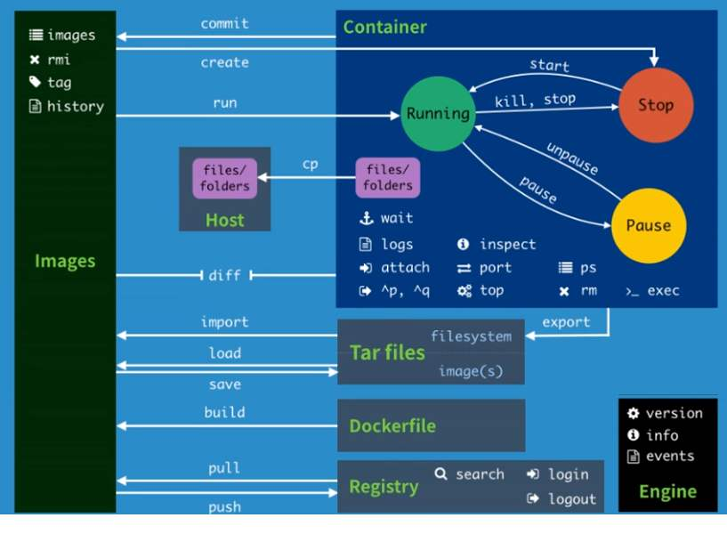

```shell
Commands:
  attach      # 当前shell下 attach 连接指定运行的镜像
  build       # 通过DockerFile 定制镜像
  commit      # 提交当前容器为新的镜像
  cp          # 从容器中拷贝指定的文件到宿主机中
  create      # 创建一个新的容器，同 run，但是不启动容器
  diff        # 查看docker容器的变化
  events      # 从docker 服务获取容器的实时事件
  exec        # 在已存在的容器上运行命令
  export      # 导出容器的内容流作为一个tar 归档文件[对应import]
  history     # 展示一个镜像的形成历史
  images      # 列出当前主机所拥有的镜像
  import      # 从tar包中的内容创建一个新的文件系统【对应export】
  info        # 显示系统相关的信息
  inspect     # 查看容器的详细信息
  kill        # kill 调指定的一个或多个容器
  load        # 从一个tar包中加载一个镜像【对应save】
  login       # 注册或者登陆一个docker源服务器
  logout      # 从docker的源服务器登出
  logs        # 输出当前的容器日志信息
  pause       # 暂停容器
  port        # 查看映射端口对应的容器内部源端口
  ps          # 列出当前运行的容器
  pull        # 从仓库拉取镜像
  push        # 推送指定的镜像或者库镜像到docker源服务器
  rename      # 重命名容器
  restart     # 重新启动容器
  rm          # 删除一个或者多个容器
  rmi         # 删除一个或者多个镜像
  run         # 启动一个新的容器
  save        # 保存镜像为一个tar包【对应load】
  search      # 从Docker Hub 查找镜像
  start       # 启动容器
  stats       # 显示容器资源使用统计数据的实时流
  stop        # 停止容器
  tag         # 给源中的镜像打标签
  top         # 列出容器中的进程
  unpause     # 取消暂停容器
  update      # 更新 容器的配置
  version     # 显示docker的版本信息
  wait        # 截取容器的停止时间时的退出状态值
```

## 作业练习

> Docker 安装nginx

```shell
# 1.查找Nginx 镜像  search   建议从Docker Hub上查找 有帮助文档可以参考
[root@iZm5e74mdg5903trjt1e17Z home]# docker search nginx
# 2.拉取下载Nginx镜像
[root@iZm5e74mdg5903trjt1e17Z home]# docker pull nginx
# 3.启动Nginx镜像
# -d 后台运行  --name 命名  -p 宿主机端口：容器内端口
[root@iZm5e74mdg5903trjt1e17Z home]# docker run -d --name nginx01 -p 6320:80 nginx
bc0eb6a42b857af57b198d8e795ecd6a0881aeb56b705ba89e0899986cbafe9b
[root@iZm5e74mdg5903trjt1e17Z home]# docker ps
CONTAINER ID        IMAGE               COMMAND                  CREATED             STATUS              PORTS                  NAMES
bc0eb6a42b85        nginx               "/docker-entrypoint.…"   4 seconds ago       Up 3 seconds        0.0.0.0:6320->80/tcp   nginx01

# 4.本机访问端口
[root@iZm5e74mdg5903trjt1e17Z home]# curl localhost:6320


# 5.进入容器
[root@iZm5e74mdg5903trjt1e17Z home]# docker ps
CONTAINER ID        IMAGE               COMMAND                  CREATED             STATUS              PORTS                  NAMES
bc0eb6a42b85        nginx               "/docker-entrypoint.…"   10 minutes ago      Up 10 minutes       0.0.0.0:6320->80/tcp   nginx01
[root@iZm5e74mdg5903trjt1e17Z home]# docker exec -it nginx01 /bin/bash
root@bc0eb6a42b85:/# whereis nginx
nginx: /usr/sbin/nginx /usr/lib/nginx /etc/nginx /usr/share/nginx
root@bc0eb6a42b85:/# cd /etc/nginx/
root@bc0eb6a42b85:/etc/nginx# ls
conf.d	fastcgi_params	koi-utf  koi-win  mime.types  modules  nginx.conf  scgi_params	uwsgi_params  win-utf
```

端口暴露的概念

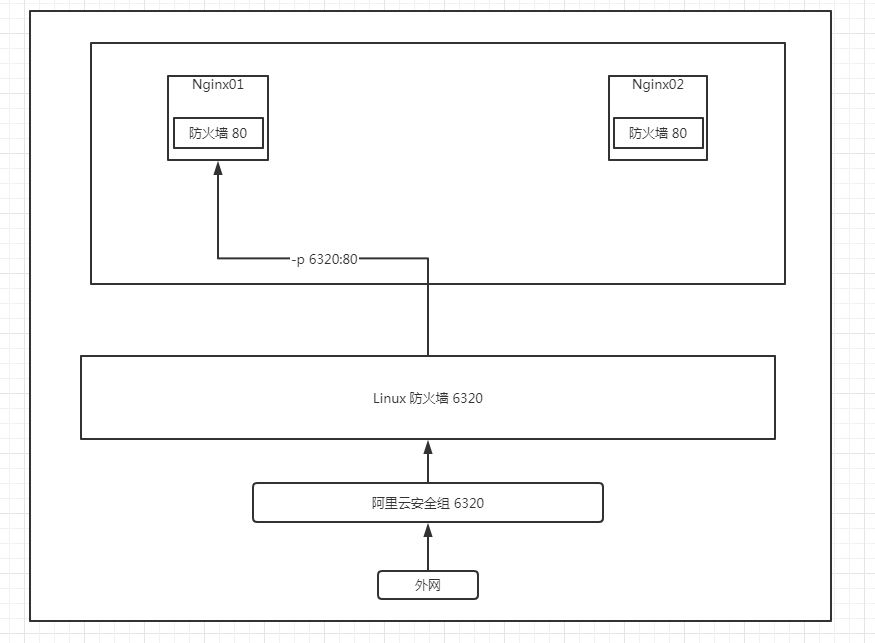

> Docker安装Tomcat

```shell
# 官方的使用
docker run -it --rm tomcat:9.0

# 之前的容器启动的都是后台，停止了容器之后，容器还是可以查到的
# docker run -it --rm 则是容器停止后直接删除 一般都是测试使用

# 下载 再启动
[root@iZm5e74mdg5903trjt1e17Z home]# docker pull tomcat

#启动运行
[root@iZm5e74mdg5903trjt1e17Z home]# docker exec -it tomcat01 /bin/cash

# 发现问题 1.Linux命令少了很多  2.没有webapps。阿里云镜像的问题，默认的是最小的镜像，所有不惜要的都剔除
# 保证最小的可运行环境
```

> Docker 部署ES和Kibana

```shell
# es 暴露的端口很多
# es 十分的耗内存
# es 的数据一般需要放置到安装目录！ 挂载
# --net somenetwork ？ 网络配置

# 下载启动elasticsearch
docker run -d --name elasticsearch  -p 9200:9200 -p 9300:9300 -e "discovery.type=single-node" elasticsearch:7.6.2

# 启动了Linux服务器就很卡  docker stats 查看容器的cpu的状态

# 启动失败或者占用内存很大的情况下 增加内存的限制 -e 环境配置修改
# -e ES_JAVA_OPTS="-Xms64m -Xmx512m"
docker run -d --name elasticsearch  -p 9200:9200 -p 9300:9300 -e "discovery.type=single-node" -e ES_JAVA_OPTS="-Xms64m -Xmx512m" elasticsearch:7.6.2


[root@iZm5e74mdg5903trjt1e17Z home]# curl localhost:9200
{
  "name" : "972494db72ed",
  "cluster_name" : "docker-cluster",
  "cluster_uuid" : "4MKsD4ubRQS40S_KkQTvrw",
  "version" : {
    "number" : "7.6.2",
    "build_flavor" : "default",
    "build_type" : "docker",
    "build_hash" : "ef48eb35cf30adf4db14086e8aabd07ef6fb113f",
    "build_date" : "2020-03-26T06:34:37.794943Z",
    "build_snapshot" : false,
    "lucene_version" : "8.4.0",
    "minimum_wire_compatibility_version" : "6.8.0",
    "minimum_index_compatibility_version" : "6.0.0-beta1"
  },
  "tagline" : "You Know, for Search"
}

```

使用kibana连接es，网络如何能够连接过去

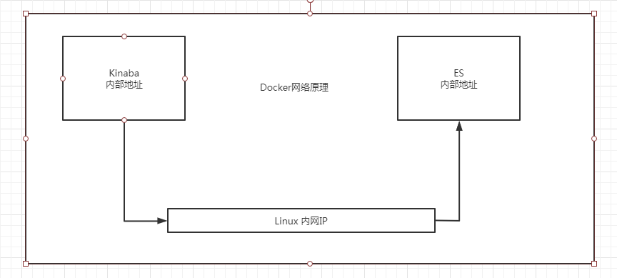

## 可视化

- portainer

```shell
# Docker图像化管理工具，提供一个后台面板提供我们操作
docker run -d -p 8088:9000 \
--restart=always -v /var/run/docker.sock:/var/fun/docker.sock --privileged=true portainer/protainer

docker run -d -p 8088:9000 --name portainer --restart always -v /var/run/docker.sock:/var/run/docker.sock --privileged=true portainer/portainer
```

# Docker镜像讲解

## 镜像是什么

镜像是一种轻量级、可执行的独立软件包，用来打包软件运行环境和基于运行环境开发的软件，它包含运行某个软件所需的所有内容，包括代码、运行时、库、环境变量和配置文件

所有的应用，直接打包docker镜像，就可以直接跑起来

如何得到镜像：

- 从远程仓库下载
- 朋友拷贝给你
- 自己制作一个镜像 DockerFile

## Docker镜像加载原理

> UnionFs （联合文件系统）

UnionFs (联合文件系统)：Union文件系统（UnionFs）是一种分层，轻量级并且高性能的文件系统，它支持对文件系统的修改作为一次提交来一层层的叠加，同时可以将不同目录挂载到同一虚拟文件系统下，Union文件系统是Docker镜像的基础。镜像可以通过分层来进行继承，基于基础镜像（没有父镜像），可以制作何种具体的应用镜像。

特性：一次同事加载多个文件系统，从外面看起来，只能看到一个文件系统，联合加载会把各层文件系统叠加起来，这样最终的文件系统会包含所有底层的文件和目录。

> Docker镜像对的加载原理

docker的镜像实际上是由一层一层的文件系统组成，这种层级的文件系统UnionFS。

bootfs（boot file system）主要包含bootloader和kernel，BootLoader主要是引导加载kernel，Linux刚启动时为加载bootfs文件系统，在Docker镜像的最底层是bootfs，这一层与我们典型的Linux/Unix 系统是一样的，包含boot加载器和内核。当boot加载完成之后整个内核都在内存中了，此时内存的使用权已由bootfs转交给内核，此时系统也会写在bootfs。

rootfs（root file system），在bootfs之上，包含的就是典型Linux系统中的/dev , /proc ,/bin,/etc 等标准目录和文件，rootfs就是各种不通的操作系统发行版，比如Ubuntu，Centos等

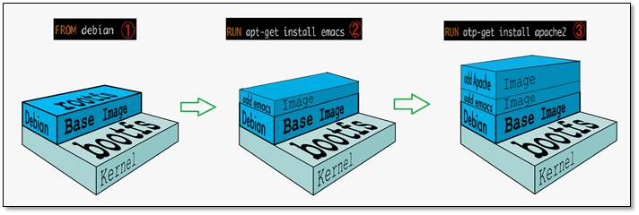

对于一个精简的OS，rootfs可以很小，只需要包含最基本的命令，工具和程序库就可以了，因为等直接用Host的kernel，自己只需要提供rootfs就可以了。由此可见对于不同的Linux发行版，bootfs基本是一直的，rootfs会有差别，因此不同的发行版可以共用bootfs。

因此虚拟机的启动时间是分钟级别的，容器的启动时间是秒级别的。

## 分层理解

> 分层的镜像

镜像的分层，最大的好处，莫过于资源分享。比如有多个镜像都从相同的Base镜像构建而来，那么宿主机只需要在磁盘上保留一份base镜像，同时内存中也只需要加载一份base镜像，这样就可以为所有的容器服务了，而且镜像的每一层都可以被共享。

查看镜像分层的方式可以通过 docker image inspect 命令！

**理解：**

所有的Docker镜像都起始于一个基础镜像层，当进行修改或增加新的内容时，就会在当前镜像层之上，创建新的镜像层。

举一个简单的例子，加入基于Ubuntu Linux 16.04创建一个新的镜像，这就是新镜像的第一层；如果在该镜像中添加Python包，就会在基础镜像层之上创建第二个镜像层，如果继续添加一个安全补丁，就会创建第三个镜像层。

该镜像当前已经包含3个镜像层，如下图所示

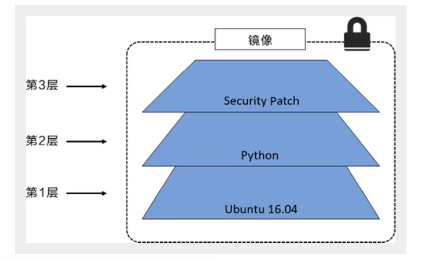

在添加额外的镜像层的同事，镜像始终保持是当前所有镜像的组合，理解这一点非常重要。下图中举了一个简单的例子，每个镜像层包含了三个文件，而镜像包含了来自两个镜像层的六个文件

> 特点

Docker 镜像都是只读的，当容器启动的时候，一个新的可写层呗加载到镜像的顶部！

这一层就是我们通常说的容器层，容器之下的都叫镜像层！

## commit镜像

```shell
docker commit # 提交容器成为一个新的副本

# 提交镜像
docker commit -m="提交的描述信息" -a="作者" 容器id 目标镜像名：[TAG]

# 如果你想要保存当前容器的状态 就将这个容器通过commit来提交，获得一个镜像
```


# 容器数据卷

##  什么是容器数据卷

**docker的理念回顾**

将应用和环境打包成一个镜像

容器之间可以有一个数据共享的技术！Docker容器中产生的数据，同步到本地！

这就是卷技术！目录的 挂载，将我们的容器内的目录，挂载到Linux上面！

**总结：容器的持久化和同步操作！容器间也是可以数据共享的！**

## 使用数据卷

> 方式一：直接使用命令来挂载 -v

```shell
docker run -it -v 主机目录：容器内目录

# 测试 将容器的home目录里的数据  同步到宿主机的/home/ceshi
[root@iZm5e74mdg5903trjt1e17Z ~]# docker run -it -v /home/ceshi:/home centos /bin/bash
[root@5d56be99bc69 /]# ls
bin  dev  etc  home  lib  lib64  lost+found  media  mnt  opt  proc  root  run  sbin  srv  sys  tmp  usr  var
[root@5d56be99bc69 /]# cd /home/
[root@5d56be99bc69 home]# ls
[root@5d56be99bc69 home]# touch test.java 
[root@5d56be99bc69 home]# ls
test.java
[root@5d56be99bc69 home]# exit
exit
[root@iZm5e74mdg5903trjt1e17Z ~]# cd /home/
[root@iZm5e74mdg5903trjt1e17Z home]# ll
total 20
drwxr-xr-x 2 root root 4096 Aug 13 22:26 ceshi
drwxr-xr-x 3 root root 4096 Jul 29 14:25 document
-rw-r--r-- 1 root root   92 Mar 15 20:13 dump.rdb
drwxr-xr-x 3 root root 4096 Jun 30 11:27 environment
drwxr-xr-x 8 root root 4096 Jun 30 15:58 soft
-rw-r--r-- 1 root root    0 Aug 13 16:49 test.java
[root@iZm5e74mdg5903trjt1e17Z home]# cd ceshi/
[root@iZm5e74mdg5903trjt1e17Z ceshi]# ll
total 0
-rw-r--r-- 1 root root 0 Aug 13 22:26 test.java
```

好处：我们以后修改只需要在本地修改即可，容器内会自动同步

## 实战：安装Mysql

```shell
#获取镜像
[root@iZm5e74mdg5903trjt1e17Z ceshi]# docker pull mysql:5.7

#运行容器 需要做数据挂载   安装启动mysql的时候需要配置密码的，这是要注意的
#官方启动mysql   -e MYSQL_ROOT_PASSWORD=my-secret-pw 设置mysql密码
docker run --name some-mysql -e MYSQL_ROOT_PASSWORD=my-secret-pw -d mysql:tag

#测试运行容器
-d	#后台运行
-v	#挂载券
-e	#设置参数

[root@iZm5e74mdg5903trjt1e17Z home]# docker run -d -p 3306:3306 -v /home/mysql/conf:/etc/mysql/conf.d -v /home/mysql/data:/var/lib/mysql -e MYSQL_ROOT_PASSWORD=root --name mysql01 mysql:5.7

# 如果我们将容器删除
# 挂载到本地的数据依旧没有丢失，就实现了容器数据持久化功能
```

## 具名挂载和匿名挂载

```shell
# 匿名挂载
-v 容器内路径
docker run -d -p --name nginx01 -v /etc/nginx nginx

#查看所有的券的所有情况
[root@iZm5e74mdg5903trjt1e17Z data]# docker volume ls
DRIVER              VOLUME NAME
local               1256b49dc56b8d47a52e845a0bd05168c431730ed487de1d2654d2f204f74a9f
# 这种就是匿名挂载，在-v的时候 只写了容器内的路径，没有写容器外的路径

# 具名挂载 通过 -v 卷名:容器内路径
[root@iZm5e74mdg5903trjt1e17Z home]# docker run -d -P --name nginx01 -v juming-nginx:/etc/nginx nginx

[root@iZm5e74mdg5903trjt1e17Z home]# docker volume ls
DRIVER              VOLUME NAME
local               1256b49dc56b8d47a52e845a0bd05168c431730ed487de1d2654d2f204f74a9f
local               juming-nginx
[root@iZm5e74mdg5903trjt1e17Z home]# docker volume inspect juming-nginx
[
    {
        "CreatedAt": "2020-08-15T09:06:38+08:00",
        "Driver": "local",
        "Labels": null,
        "Mountpoint": "/var/lib/docker/volumes/juming-nginx/_data",
        "Name": "juming-nginx",
        "Options": null,
        "Scope": "local"
    }
]


# 所有docker容器的卷，没有指定目录的情况下都是在/var/lib/docker/volumes/目录下
# 我们通过具名挂在可以方便的找到我们的一个卷，大多数情况在使用的是 具名挂载

# 如何确地是具名挂载还是匿名挂载，还是指定路径挂载
-v 容器内路径			#匿名挂载
-v 卷名：容器内路径		  #具名挂载
-v /宿主机路径:容器内路径	 #指定路径挂载
```

# DockerFile

扩展

```shell
# 通过 -v 容器内路径 ，ro rw 改变读写权限
ro	readonly	# 只读
rw	readwrite	# 可读可写

# 一旦这个设置了容器权限，容器对我们挂载出来的内容就限定了
docker run -d -P --name nginx01 -v juming-nginx:/etc/nginx:ro nginx
docker run -d -P --name nginx01 -v juming-nginx:/etc/nginx:rw nginx

# ro 只要看到ro就说明这个路径只能通过宿主机来操作，容器内部是无法操作的
```

## 初识Dockerfile

> **方式二：**

Dockerfile是用来构建docker镜像的构建文件！

通过这个脚本可以生成镜像，镜像是一层一层的，脚本一个个的命令，每个命令都是一层

```shell
# 创建一个dockerfile文件  名字可以随机，建议使用Dockerfile
# 文件中的内容 指定（大写） 参数
[root@iZm5e74mdg5903trjt1e17Z docker-test-volume]# cat Dockerfile 
FROM centos

VOLUME ["volume01","volume02"]   # 匿名挂载

CMD echo "------end------"

CMD /bin/bash

# 执行docker build 构建镜像
[root@iZm5e74mdg5903trjt1e17Z docker-test-volume]# docker build -f /home/docker-test-volume/Dockerfile -t zhang/centos:01 .
Sending build context to Docker daemon  2.048kB
Step 1/4 : FROM centos
 ---> 0d120b6ccaa8
Step 2/4 : VOLUME ["volume01","volume02"]
 ---> Running in 80028daf02b7
Removing intermediate container 80028daf02b7
 ---> 128ffb44288c
Step 3/4 : CMD echo "------end------"
 ---> Running in 64819907007b
Removing intermediate container 64819907007b
 ---> 13ba23424236
Step 4/4 : CMD /bin/bash
 ---> Running in b0b6f84c5390
Removing intermediate container b0b6f84c5390
 ---> b86c76e15783
Successfully built b86c76e15783
Successfully tagged zhang/centos:01


# 运行创建的镜像
[root@iZm5e74mdg5903trjt1e17Z docker-test-volume]# docker run -it b86c76e15783
[root@68ef1c6f4c2a /]# ls -l
total 56
drwxrwxrwt  7 root root 4096 Aug  9 21:40 tmp
drwxr-xr-x 12 root root 4096 Aug  9 21:40 usr
drwxr-xr-x 20 root root 4096 Aug  9 21:40 var
drwxr-xr-x  2 root root 4096 Aug 15 01:44 volume01	#挂载的卷
drwxr-xr-x  2 root root 4096 Aug 15 01:44 volume02	#挂载的卷

# 在volume01的目录下随便创建一个文件
# 退出容器
# docker inspect 容器id  查看刚才的容器的详细信息，找到挂载卷的主机文件路径
[root@iZm5e74mdg5903trjt1e17Z docker-test-volume]# docker inspect 68ef1c6f4c2a
"Mounts": [
            {
                "Type": "volume",
                "Name": "dca8f681198e35a5ee4eab5023aa8e2a0c614fe3d68a2124b647b10bcee89dc3",
                "Source": "/var/lib/docker/volumes/dca8f681198e35a5ee4eab5023aa8e2a0c614fe3d68a2124b647b10bcee89dc3/_data",
                "Destination": "volume02",
                "Driver": "local",
                "Mode": "",
                "RW": true,
                "Propagation": ""
            },
            {
                "Type": "volume",
                "Name": "1c6d384a13455b7b9b9d30ec993912b7bd7d22131adc7778a4e4aec610f899af",
                "Source": "/var/lib/docker/volumes/1c6d384a13455b7b9b9d30ec993912b7bd7d22131adc7778a4e4aec610f899af/_data",
                "Destination": "volume01",
                "Driver": "local",
                "Mode": "",
                "RW": true,
                "Propagation": ""
            }
        ],
# 进入volume01 的路径查看是否有容器新增的文件

# 假设构建镜像的时候没有挂载卷，要手动镜像挂载  -v 卷名：容器内路径
```

## 数据卷容器

```shell
# 启动三个容器 

[root@iZm5e74mdg5903trjt1e17Z /]# docker images
REPOSITORY            TAG                 IMAGE ID            CREATED             SIZE
zhang/centos          01                  b86c76e15783        4 hours ago         215MB
centos                latest              0d120b6ccaa8        4 days ago          215MB
nginx                 latest              08393e824c32        10 days ago         132MB
mysql                 5.7                 718a6da099d8        10 days ago         448MB
portainer/portainer   latest              62771b0b9b09        3 weeks ago         79.1MB
# 启动第一个容器
[root@iZm5e74mdg5903trjt1e17Z /]# docker run -it --name docker01 b86c76e15783

# 启动第二个容器
# --volumes-from docker01   挂载继承 docker01   
# docker01 中的volume01 和volume02的文件夹做了更改，docker02中相同的文件夹的数据就会更改
[root@iZm5e74mdg5903trjt1e17Z /]# docker run -it --name docker02 --volumes-from docker01 b86c76e15783

#当docker01 容器彻底删除之后   docker02中的数据仍然存在
```

> 多个mysql之间实现数据共享

```shell
# 第一个mysql
docker run -d -p 3306:3306 -v /etc/mysql/conf.d -v /var/lib/mysql -e MYSQL_ROOT_PASSWORD=root --name mysql01 mysql:5.7

# 第二个mysql 继承第一个mysql的挂载
docker run -d -p 3306:3306 -e MYSQL_ROOT_PASSWORD=root --name mysql02 --volumes-from mysql01 mysql:5.7
```

结论：

容器之间配置信息的传递，数据卷容器的生命周期一直持续到没有容器使用为止

如果数据持久化到了本地，这个时候，本地的数据就不会被删除

# DockerFile

dockerfile是用来构建docker镜像的文件，命令参数脚本

构建步骤：

1. 编写一个dockerfile文件
2. docker build构建成为一个镜像
3. docker run运行镜像
4. docker push发布镜像（Docker Hub，阿里云镜像仓库）

```shell
# centos 7 的dockerfile文件
FROM scratch
ADD centos-7-x86_64-docker.tar.xz /

LABEL \
    org.label-schema.schema-version="1.0" \
    org.label-schema.name="CentOS Base Image" \
    org.label-schema.vendor="CentOS" \
    org.label-schema.license="GPLv2" \
    org.label-schema.build-date="20200809" \
    org.opencontainers.image.title="CentOS Base Image" \
    org.opencontainers.image.vendor="CentOS" \
    org.opencontainers.image.licenses="GPL-2.0-only" \
    org.opencontainers.image.created="2020-08-09 00:00:00+01:00"

CMD ["/bin/bash"]

# 很多官方的镜像都是基础包，很多的功能都没有，就需要自己搭建自己需要的镜像
```

## dockerfile的构建过程

DockerFile：构建文件，定义一切的步骤，源代码

DockerImages：通过DockerFile构建生成的镜像，最终发布和运行的产品

Docker容器：容器就是镜像运行起来提供服务器

## DockerFile的指令

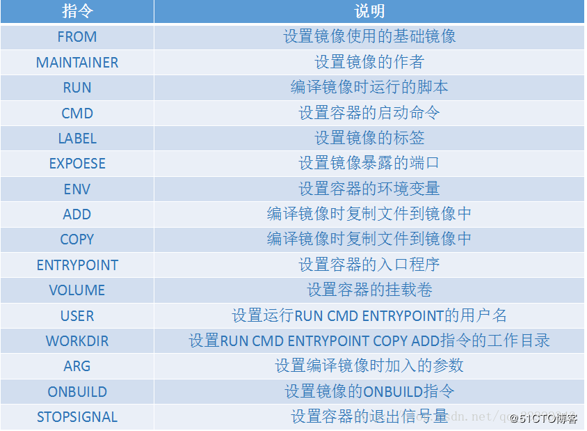

```shell
FROM			# 基础镜像，一切从这里开始构建
MAINTAINER		# 镜像是谁写的，姓名+邮箱
RUN				# 镜像构建的时候需要运行的命令
ADD				# 编译镜像的时候，复制文件到镜像中
WORKDIR			# 镜像的工作目录
VOLUME			# 设置容器的挂载卷
EXPOESE			# 设置镜像暴露的端口
CMD				# 设置容器的启动命令，只有最后一个会生效，可被替代
ENTRYPOINT		# 设置容器的入口程序。可以追加命令
ONBUILD			# 当构建一个被继承Dockerfile 这个时候就会运行ONBUILD的指令。触发指令
COPY			# 编译镜像时复制文件到镜像中，类似ADD
ENV				# 构建的时候设置环境变量
```

## 实战测试

Docker Hub中99%的镜像都是从FROM scratch 开始的。

> 创建一个自己的centos

```shell
# 1. 编写dockerfile文件
[root@iZm5e74mdg5903trjt1e17Z dockerfile]# cat mydockerfile-centos 
FROM centos

MAINTAINER Lijiat<zjl509606@163.com>

ENV MYPATH /usr/local
WORKDIR	$MYPATH

RUN yum -y install vim
RUN yum -y install net-tools

EXPOSE 80


CMD echo $MYPATH
CMD echo "-----end-----"
CMD /bin/bash


# 2.根据dockerfile构建镜像
[root@iZm5e74mdg5903trjt1e17Z dockerfile]# docker build -f mydockerfile-centos -t mycentos:0.1 .
Successfully built 6553d6634583
Successfully tagged mycentos:0.1

# 3. 测试运行镜像
[root@iZm5e74mdg5903trjt1e17Z dockerfile]# docker run -it 6553d6634583

# 通过docker history 查看镜像是怎么构建的
[root@iZm5e74mdg5903trjt1e17Z dockerfile]# docker history 6553d6634583
IMAGE               CREATED             CREATED BY                                      SIZE                COMMENT
6553d6634583        5 minutes ago       /bin/sh -c #(nop)  CMD ["/bin/sh" "-c" "/bin…   0B                  
e9131c47f0fe        5 minutes ago       /bin/sh -c #(nop)  CMD ["/bin/sh" "-c" "echo…   0B                  
6d16b14aee86        5 minutes ago       /bin/sh -c #(nop)  CMD ["/bin/sh" "-c" "echo…   0B                  
5e16af0cc6c6        5 minutes ago       /bin/sh -c #(nop)  EXPOSE 80                    0B                  
9b5d1fbba7c5        5 minutes ago       /bin/sh -c yum -y install net-tools             22.8MB              
ab88913287fc        5 minutes ago       /bin/sh -c yum -y install vim                   57.2MB              
5889b2277f82        5 minutes ago       /bin/sh -c #(nop) WORKDIR /usr/local            0B                  
f2f6ab33dd8d        5 minutes ago       /bin/sh -c #(nop)  ENV MYPATH=/usr/local        0B                  
e697026cdb8b        5 minutes ago       /bin/sh -c #(nop)  MAINTAINER Lijiat<zjl5096…   0B                  
0d120b6ccaa8        5 days ago          /bin/sh -c #(nop)  CMD ["/bin/bash"]            0B                  
<missing>           5 days ago          /bin/sh -c #(nop)  LABEL org.label-schema.sc…   0B                  
<missing>           5 days ago          /bin/sh -c #(nop) ADD file:538afc0c5c964ce0d…   215MB
```

> CMD和ENTRYPOINT的区别

```shell
CMD				# 设置容器的启动命令，只有最后一个会生效，可被替代
ENTRYPOINT		# 设置容器的入口程序。可以追加命令
```

测试cmd

```shell
# 编写dockerfile文件
[root@iZm5e74mdg5903trjt1e17Z dockerfile]# vim dockerfile-cmd-test
FROM centos

CMD ["ls","-a"]
# 构建镜像
[root@iZm5e74mdg5903trjt1e17Z dockerfile]# docker build -f dockerfile-cmd-test -t cmdtest .

# run 运行 会发现 ls -a命令运行了

[root@iZm5e74mdg5903trjt1e17Z dockerfile]# docker run cmdtest
.
..
.dockerenv
bin
dev
etc
home
lib
lib64
lost+found
media
mnt

# 如果再追加一个不存在标准的命令时 就会报错
[root@iZm5e74mdg5903trjt1e17Z dockerfile]# docker run cmdtest -l
docker: Error response from daemon: OCI runtime create failed: container_linux.go:349: starting container process caused "exec: \"-l\": executable file not found in $PATH": unknown.
# 增加正常的命令就会执行 ls -al  而不会执行dockerfile中的 ls -a
[root@iZm5e74mdg5903trjt1e17Z dockerfile]# docker run cmdtest ls -al
total 56
drwxr-xr-x  1 root root 4096 Aug 16 14:47 .
drwxr-xr-x  1 root root 4096 Aug 16 14:47 ..
-rwxr-xr-x  1 root root    0 Aug 16 14:47 .dockerenv
lrwxrwxrwx  1 root root    7 May 11  2019 bin -> usr/bin
drwxr-xr-x  5 root root  340 Aug 16 14:47 dev
drwxr-xr-x  1 root root 4096 Aug 16 14:47 etc
drwxr-xr-x  2 root root 4096 May 11  2019 home
lrwxrwxrwx  1 root root    7 May 11  2019 lib -> usr/lib
lrwxrwxrwx  1 root root    9 May 11  2019 lib64 -> usr/lib64
drwx------  2 root root 4096 Aug  9 21:40 lost+found
drwxr-xr-x  2 root root 4096 May 11  2019 media
drwxr-xr-x  2 root root 4096 May 11  2019 mnt
```

测试ENTRYPOINT

```shell
# 编写dockerfile文件
[root@iZm5e74mdg5903trjt1e17Z dockerfile]# vim dockerfile-entrypoint-test
FROM centos

ENTRYPOINT ["ls","-a"]
# entrypoint 在执行run镜像的时候  增加 -l命令  就会追加到dockerfile的 ls -a 的后面 而不是替换
[root@iZm5e74mdg5903trjt1e17Z dockerfile]# docker run entrypoint-test -l
```

## 实战tomcat镜像

1. 准备镜像文件tomcat压缩包 ，jdk压缩包

```shell
[root@iZm5e74mdg5903trjt1e17Z tomcat]# ll
total 150728
-rw-r--r-- 1 root root  11211292 Aug 16 22:55 apache-tomcat-9.0.37.tar.gz
-rw-r--r-- 1 root root       634 Aug 17 14:45 Dockerfile
-rw-r--r-- 1 root root 143111803 Aug 16 23:10 jdk-8u261-linux-x64.tar.gz
-rw-r--r-- 1 root root        16 Aug 17 14:08 readme.txt
```

2. 编写dockerfile文档  官方命名为Dockerfile

```shell
[root@iZm5e74mdg5903trjt1e17Z tomcat]# cat Dockerfile 
FROM centos
MAINTAINER zhang<zjl509606@163.com>

COPY readme.txt /usr/local/readme.txt


ADD apache-tomcat-9.0.37.tar.gz /usr/local/
ADD jdk-8u261-linux-x64.tar.gz /usr/local/

RUN yum -y install vim

ENV MYPATH /usr/local
WORKDIR $MYPATH

ENV JAVA_HOME /usr/local/jdk1.8.0_261
ENV CLASSPATH $JAVA_HOME/lib/dt.jar:$JAVA_HOME/lib/tools.jar
ENV CATALINA_HOME /usr/local/apache-tomcat-9.0.37
ENV CATALINA_BASH /usr/local/apache-tomcat-9.0.37
ENV PATH $PATH:$JAVA_HOME/bin:$CATALINA_HOME/lib:$CATALINA_HOME/bin

EXPOSE 8080

CMD /usr/local/apache-tomcat-9.0.37/bin/startup.sh && tail -f /usr/local/apache-tomcat-9.0.37/logs/catalina.out
```

3. 构建镜像

```shell
[root@iZm5e74mdg5903trjt1e17Z tomcat]# docker buid -t divtomcat .
```

4. 启动镜像

```shell
[root@iZm5e74mdg5903trjt1e17Z tomcat]# docker run -d -p 8060:8080 --name lijiattomcat -v /home/zhang/build/tomcat/test:/usr/local/apache-tomcat-9.0.37/webapps/test/ -v /home/zhang/build/tomcat/tomcatlogs/:/usr/local/apache-tomcat-9.0.37/logs/ divtomcat
```

5. 访问测试
6. 发布项目（由于做了卷挂载，可以直接在本机的目录文件修改项目了）

```xml
<web-app xmlns="http://java.sun.com/xml/ns/javaee"
           xmlns:xsi="http://www.w3.org/2001/XMLSchema-instance"
           xsi:schemaLocation="http://java.sun.com/xml/ns/javaee
                               http://java.sun.com/xml/ns/javaee/web-app_2_5.xsd"
           version="2.5">

</web-app>
```

```jsp
<%@ page language="java" contentType="text/html; charset=UTF-8"
    pageEncoding="UTF-8"%>
<!DOCTYPE html>
<html>
<head>
<meta charset="utf-8">
<title>zhang</title>
</head>
<body>
Hello World!<br/>
The time on the server is <%= new java.util.Date() %>
<%
out.println("你的 IP 地址 " + request.getRemoteAddr());
%>
<%
System.out.println("访问： " + request.getRemoteAddr());
%>
</body>
</html>
```

## 发布镜像

> 发布到docker hub

```shell
# 1. 先登录docker hub    通过 docker login
[root@iZm5e74mdg5903trjt1e17Z ~]# docker login -u lijiat
Password: 
WARNING! Your password will be stored unencrypted in /root/.docker/config.json.
Configure a credential helper to remove this warning. See
https://docs.docker.com/engine/reference/commandline/login/#credentials-store

Login Succeeded

# 2. 提交镜像  通过 docker push
# lijiat 为登录的账户名   还需要加上版本号
[root@iZm5e74mdg5903trjt1e17Z ~]# docker push lijiat/divtomcat:1.0

# 如果没有版本号   就为镜像增加tag
[root@iZm5e74mdg5903trjt1e17Z ~]# docker tag 5b73a42ad0a2 lijiat/tomcat:1.0
[root@iZm5e74mdg5903trjt1e17Z ~]# docker push lijiat/tomcat:1.0
The push refers to repository [docker.io/lijiat/tomcat]
```


> 发布到阿里云镜像服务上

1. 登录阿里云
2. 找到容器镜像服务
3. 创建命名空间


4. 创建镜像仓库


5. 查看镜像仓库推送的步骤

```shell
# 1. 登录阿里云Docker Registry
$ sudo docker login --username=lijiat_01 registry.cn-qingdao.aliyuncs.com
# 用于登录的用户名为阿里云账号全名，密码为开通服务时设置的密码。

# 您可以在访问凭证页面修改凭证密码。

# 2. 从Registry中拉取镜像
$ sudo docker pull registry.cn-qingdao.aliyuncs.com/lijiat-docker/lijiat-tets:[镜像版本号]
# 3. 将镜像推送到Registry
$ sudo docker login --username=lijiat_01 registry.cn-qingdao.aliyuncs.com
$ sudo docker tag [ImageId] registry.cn-qingdao.aliyuncs.com/lijiat-docker/lijiat-tets:[镜像版本号]
$ sudo docker push registry.cn-qingdao.aliyuncs.com/lijiat-docker/lijiat-tets:[镜像版本号]
# 请根据实际镜像信息替换示例中的[ImageId]和[镜像版本号]参数。

# 4. 选择合适的镜像仓库地址
# 从ECS推送镜像时，可以选择使用镜像仓库内网地址。推送速度将得到提升并且将不会损耗您的公网流量。

# 如果您使用的机器位于VPC网络，请使用 registry-vpc.cn-qingdao.aliyuncs.com 作为Registry的域名登录，并作为镜像命名空间前缀。
# 5. 示例
# 使用"docker tag"命令重命名镜像，并将它通过专有网络地址推送至Registry。

$ sudo docker images
REPOSITORY                                                         TAG                 IMAGE ID            CREATED             VIRTUAL SIZE
registry.aliyuncs.com/acs/agent                                    0.7-dfb6816         37bb9c63c8b2        7 days ago          37.89 MB
$ sudo docker tag 37bb9c63c8b2 registry-vpc.cn-qingdao.aliyuncs.com/acs/agent:0.7-dfb6816
# 使用"docker images"命令找到镜像，将该镜像名称中的域名部分变更为Registry专有网络地址。

$ sudo docker push registry-vpc.cn-qingdao.aliyuncs.com/acs/agent:0.7-dfb6816
```


# Docker 网络

### 理解网络

> 测试

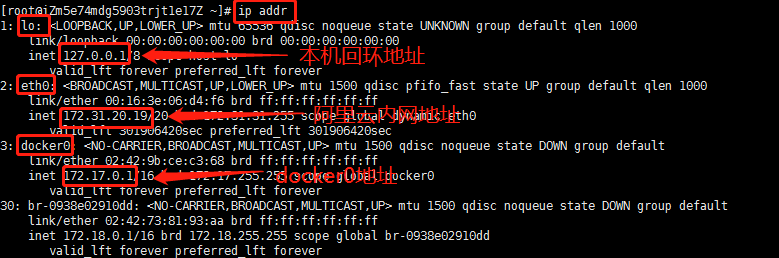

```shell
# 问题 docker 是如何处理容器网络访问的？
```


```shell
# 运行一个Tomcat容器
[root@iZm5e74mdg5903trjt1e17Z ~]# docker run -d -P --name tomcat01 tomcat

# 查看容器的内部网络地址 ip addr   容器启动的时候会得到一个 eth0@if116 ip地址 docker分配的
[root@iZm5e74mdg5903trjt1e17Z ~]# docker exec -it tomcat01 ip addr
1: lo: <LOOPBACK,UP,LOWER_UP> mtu 65536 qdisc noqueue state UNKNOWN group default qlen 1000
    link/loopback 00:00:00:00:00:00 brd 00:00:00:00:00:00
    inet 127.0.0.1/8 scope host lo
       valid_lft forever preferred_lft forever
115: eth0@if116: <BROADCAST,MULTICAST,UP,LOWER_UP> mtu 1500 qdisc noqueue state UP group default 
    link/ether 02:42:ac:11:00:02 brd ff:ff:ff:ff:ff:ff link-netnsid 0
    inet 172.17.0.2/16 brd 172.17.255.255 scope global eth0
       valid_lft forever preferred_lft forever

# 思考 Linux能不能ping通  容器内部
[root@iZm5e74mdg5903trjt1e17Z ~]# ping 172.17.0.2
PING 172.17.0.2 (172.17.0.2) 56(84) bytes of data.
64 bytes from 172.17.0.2: icmp_seq=1 ttl=64 time=0.095 ms
64 bytes from 172.17.0.2: icmp_seq=2 ttl=64 time=0.076 ms
64 bytes from 172.17.0.2: icmp_seq=3 ttl=64 time=0.072 ms

```

> 原理

1. 我们每启动一个docker容器，docker就会给docker容器分配一个ip，我们只要安装docker，就会有一个网卡docker0桥接模式，使用的技术是veth-pair技术

再次测试ip addr

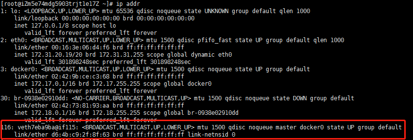

2. 再次启动一个容器测试

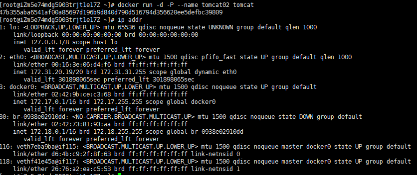

```shell
# 发现这个容器的网卡，都是一对一对的
# evth-pair 就是一对的虚拟设备接口，他们都是成对出现的，一端连着协议，一端彼此相连
# 正因为有这个特性，veth-pair充当一个桥梁，链接各种虚拟网络设备的
# OpenStack，Docker容器之间的链接，OVS的连接，都是使用的veth-pair技术
```

3. 测试一下容器tomcat01 和 tomcat02 之间是否可以ping通

```shell
[root@iZm5e74mdg5903trjt1e17Z ~]# docker exec -it tomcat01 ping 172.17.0.2
PING 172.17.0.2 (172.17.0.2) 56(84) bytes of data.
64 bytes from 172.17.0.2: icmp_seq=1 ttl=64 time=0.056 ms
64 bytes from 172.17.0.2: icmp_seq=2 ttl=64 time=0.050 ms

# 结论：容器和容器之间是可以ping通的
```

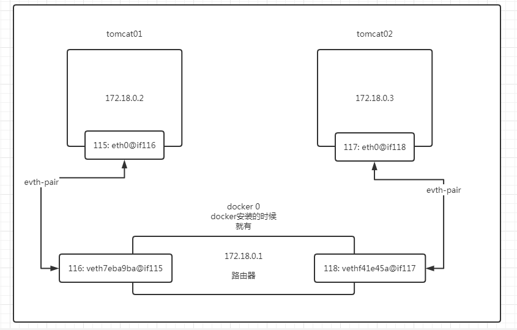

结论：tomcat和tomcat02 是共用的一个路由器，docker0

所有的容器不指定网路的情况下，都是docker0路由器，docker会给我们的容器分配一个默认的可用ip

Docker中的所有网络都是虚拟的，虚拟的转发效率高（内网传递文件）

只要容器删除，对应的网桥一对就没有了。

### --link

> 思考一个场景，我们编写一个微服务，database uri：ip，项目不重启，数据库ip换掉了，希望可以解决这个问题，通过名字访问容器

```shell
# 直接用tomcat01 ping tomcat02是ping不通的
[root@iZm5e74mdg5903trjt1e17Z ~]# docker exec -it tomcat01 ping tomcat02
ping: tomcat02: Name or service not known

# 创建tomcat03 --link tomcat01
[root@iZm5e74mdg5903trjt1e17Z ~]# docker run -d -P --name tomcat03 --link tomcat01 tomcat
52731cef596c261d47242b29db66c3763375d3efe3e1f6af517e49627a399a5a

# 用tomcat01 ping tomcat03是ping不通的
[root@iZm5e74mdg5903trjt1e17Z ~]# docker exec -it tomcat01 ping tomcat03
ping: tomcat03: Name or service not known

# 用tomcat03 ping tomcat01是可以ping通的
[root@iZm5e74mdg5903trjt1e17Z ~]# docker exec -it tomcat03 ping tomcat01
PING tomcat01 (172.17.0.2) 56(84) bytes of data.
64 bytes from tomcat01 (172.17.0.2): icmp_seq=1 ttl=64 time=0.108 ms
64 bytes from tomcat01 (172.17.0.2): icmp_seq=2 ttl=64 time=0.079 ms
64 bytes from tomcat01 (172.17.0.2): icmp_seq=3 ttl=64 time=0.073 ms
64 bytes from tomcat01 (172.17.0.2): icmp_seq=4 ttl=64 time=0.073 ms
^C
--- tomcat01 ping statistics ---
4 packets transmitted, 4 received, 0% packet loss, time 3ms
rtt min/avg/max/mdev = 0.073/0.083/0.108/0.015 ms

```

现在玩docker已经不建议使用了

### 探究inspect

```shell
# docker network ls 可以查看当前网络的情况
[root@iZm5e74mdg5903trjt1e17Z ~]# docker network ls
NETWORK ID          NAME                DRIVER              SCOPE
f00fbf1eb56c        bridge              bridge              local
ad39af0674ff        host                host                local
c1459160498e        none                null                local
0938e02910dd        test-net            bridge              local

# 使用 docker network inspect [NETWORK ID]  可以查看这个网络的详细情况
[root@iZm5e74mdg5903trjt1e17Z ~]# docker network inspect f00fbf1eb56c

# 使用 docker inspect [容器id] 查看容器的具体情况
[root@iZm5e74mdg5903trjt1e17Z ~]# docker inspect 52731cef596c
"HostConfig": {
            "Binds": null,
            "ContainerIDFile": "",
            "LogConfig": {
                "Type": "json-file",
                "Config": {}
            },
            "NetworkMode": "default",
            "PortBindings": {},
            "RestartPolicy": {
                "Name": "no",
                "MaximumRetryCount": 0
            },
            "AutoRemove": false,
            "VolumeDriver": "",
            "VolumesFrom": null,
            "CapAdd": null,
            "CapDrop": null,
            "Capabilities": null,
            "Dns": [],
            "DnsOptions": [],
            "DnsSearch": [],
            "ExtraHosts": null,
            "GroupAdd": null,
            "IpcMode": "private",
            "Cgroup": "",
            "Links": [
                "/tomcat01:/tomcat03/tomcat01"   #tomcat03 配置了 tomcat01的链接
            ],
# 查看容器内的 hosts文件也可以看到网络的配置
[root@iZm5e74mdg5903trjt1e17Z ~]# docker exec -it tomcat03 cat /etc/hosts
127.0.0.1	localhost
::1	localhost ip6-localhost ip6-loopback
fe00::0	ip6-localnet
ff00::0	ip6-mcastprefix
ff02::1	ip6-allnodes
ff02::2	ip6-allrouters
172.17.0.2	tomcat01 5fb904f21e5b  #再次绑定了tomcat01 的网络
172.17.0.4	52731cef596c
```

### 自定义网络

> 查看所有的docker网络

```shell
[root@iZm5e74mdg5903trjt1e17Z ~]# docker network ls
NETWORK ID          NAME                DRIVER              SCOPE
f00fbf1eb56c        bridge              bridge              local
ad39af0674ff        host                host                local
c1459160498e        none                null                local
0938e02910dd        test-net            bridge              local
```

**网络模式：**

bridge：桥接（默认，自己创建也使用的桥接模式）

none：不配置网络

host：和宿主机共享网络

container：容器网络连通（用的少，局限很大）

```shell
# 在启动项目的时候  会默认设置 --net bridge 默认为docker0的网关
[root@iZm5e74mdg5903trjt1e17Z ~]# docker run -d -P --name tomcat01 --net bridge tomcat

# 设置自定义网络
# --driver 网络模式  默认bridge
# --subnet 设置子网掩码
# --gateway 设置网关
[root@iZm5e74mdg5903trjt1e17Z ~]# docker network create --driver bridge --subnet 192.168.0.0/16 --gateway 192.168.0.1 mynet
381bd57183c3b27edcc19f4d2f5de22da057e82f163137f4f0720081333044af
[root@iZm5e74mdg5903trjt1e17Z ~]# docker network ls
NETWORK ID          NAME                DRIVER              SCOPE
f00fbf1eb56c        bridge              bridge              local
ad39af0674ff        host                host                local
381bd57183c3        mynet               bridge              local
c1459160498e        none                null                local
0938e02910dd        test-net            bridge              local


# 查看自己定义的网络信息
[root@iZm5e74mdg5903trjt1e17Z ~]# docker network inspect mynet
[
    {
        "Name": "mynet",
        "Id": "381bd57183c3b27edcc19f4d2f5de22da057e82f163137f4f0720081333044af",
        "Created": "2020-08-18T15:19:16.568789731+08:00",
        "Scope": "local",
        "Driver": "bridge",
        "EnableIPv6": false,
        "IPAM": {
            "Driver": "default",
            "Options": {},
            "Config": [
                {
                    "Subnet": "192.168.0.0/16",
                    "Gateway": "192.168.0.1"
                }
            ]
        },
        "Internal": false,
        "Attachable": false,
        "Ingress": false,
        "ConfigFrom": {
            "Network": ""
        },
        "ConfigOnly": false,
        "Containers": {},
        "Options": {},
        "Labels": {}
    }
]
```

根据自定义的网络启动两个容器

```shell
[root@iZm5e74mdg5903trjt1e17Z ~]# docker run -d -P --name tomcat-net-01 --net mynet tomcat
eca6526ea671d540097aa8190efb7af5ce0d1b8071a0fb304f1dd0207b40fc14
[root@iZm5e74mdg5903trjt1e17Z ~]# docker run -d -P --name tomcat-net-02 --net mynet tomcat
8402509c32af4b2876315c283ddb9582827d5d6a181d690f3d3b7c492d675b0c
[root@iZm5e74mdg5903trjt1e17Z ~]# docker network inspect mynet
[
    {
        "Name": "mynet",
        "Id": "381bd57183c3b27edcc19f4d2f5de22da057e82f163137f4f0720081333044af",
        "Created": "2020-08-18T15:19:16.568789731+08:00",
        "Scope": "local",
        "Driver": "bridge",
        "EnableIPv6": false,
        "IPAM": {
            "Driver": "default",
            "Options": {},
            "Config": [
                {
                    "Subnet": "192.168.0.0/16",
                    "Gateway": "192.168.0.1"
                }
            ]
        },
        "Internal": false,
        "Attachable": false,
        "Ingress": false,
        "ConfigFrom": {
            "Network": ""
        },
        "ConfigOnly": false,
        "Containers": {
            "8402509c32af4b2876315c283ddb9582827d5d6a181d690f3d3b7c492d675b0c": {
                "Name": "tomcat-net-02",
                "EndpointID": "2dea5c4ac61ad6bb8d96590dc2c7e12d11c3e56fa7bb3017d5d8165845f82e0e",
                "MacAddress": "02:42:c0:a8:00:03",
                "IPv4Address": "192.168.0.3/16",
                "IPv6Address": ""
            },
            "eca6526ea671d540097aa8190efb7af5ce0d1b8071a0fb304f1dd0207b40fc14": {
                "Name": "tomcat-net-01",
                "EndpointID": "70c0bd53a2a704cb00c3db967d54ca5f7170036fb1c9ddd25281c7ff76d6aa61",
                "MacAddress": "02:42:c0:a8:00:02",
                "IPv4Address": "192.168.0.2/16",
                "IPv6Address": ""
            }
        },
        "Options": {},
        "Labels": {}
    }
]


# 使用自定义的网络启动容器之后，就可以直接根据容器名ping数据了
[root@iZm5e74mdg5903trjt1e17Z ~]# docker exec -it tomcat-net-01 ping tomcat-net-02
PING tomcat-net-02 (192.168.0.3) 56(84) bytes of data.
64 bytes from tomcat-net-02.mynet (192.168.0.3): icmp_seq=1 ttl=64 time=0.092 ms
64 bytes from tomcat-net-02.mynet (192.168.0.3): icmp_seq=2 ttl=64 time=0.083 ms
^C
--- tomcat-net-02 ping statistics ---
2 packets transmitted, 2 received, 0% packet loss, time 1000ms
rtt min/avg/max/mdev = 0.083/0.087/0.092/0.010 ms

```

好处：

redis集群：不同的集群使用不同的网络，保证集群是安全和健康的

mysql集群：不同的集群使用不同的网络，保证集群是安全和健康的

### 网络连通

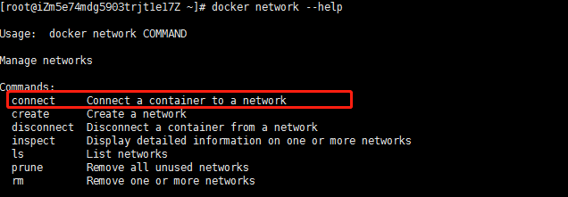


```shell
# 启动tomcat01容器和tomcat02容器
# 测试打通 tomcat01 - mynet
[root@iZm5e74mdg5903trjt1e17Z ~]# docker network connect mynet tomcat01

# 连通之后  tomcat01就会被分配到mynet的网络之下了
# 一个容器两个ip
"Containers": {
            "032f01ee76b72a379ee96c8e3d034db238f086988c6687c9d9f52ad576e034f0": {
                "Name": "tomcat01",
                "EndpointID": "ac4c8395771c038e308c44b4b9de5381647bff299907083bfad6f7494eafd504",
                "MacAddress": "02:42:c0:a8:00:04",
                "IPv4Address": "192.168.0.4/16",
                "IPv6Address": ""
            },
            "8402509c32af4b2876315c283ddb9582827d5d6a181d690f3d3b7c492d675b0c": {
                "Name": "tomcat-net-02",
                "EndpointID": "2dea5c4ac61ad6bb8d96590dc2c7e12d11c3e56fa7bb3017d5d8165845f82e0e",
                "MacAddress": "02:42:c0:a8:00:03",
                "IPv4Address": "192.168.0.3/16",
                "IPv6Address": ""
            },
            "eca6526ea671d540097aa8190efb7af5ce0d1b8071a0fb304f1dd0207b40fc14": {
                "Name": "tomcat-net-01",
                "EndpointID": "70c0bd53a2a704cb00c3db967d54ca5f7170036fb1c9ddd25281c7ff76d6aa61",
                "MacAddress": "02:42:c0:a8:00:02",
                "IPv4Address": "192.168.0.2/16",
                "IPv6Address": ""
            }
        },

# 这样容器就连通了
[root@iZm5e74mdg5903trjt1e17Z ~]# docker exec -it tomcat01 ping tomcat-net-01
PING tomcat-net-01 (192.168.0.2) 56(84) bytes of data.
64 bytes from tomcat-net-01.mynet (192.168.0.2): icmp_seq=1 ttl=64 time=0.079 ms
64 bytes from tomcat-net-01.mynet (192.168.0.2): icmp_seq=2 ttl=64 time=0.090 ms
^C
--- tomcat-net-01 ping statistics ---
2 packets transmitted, 2 received, 0% packet loss, time 1000ms
rtt min/avg/max/mdev = 0.079/0.084/0.090/0.010 ms

```

### 实战部署redis集群

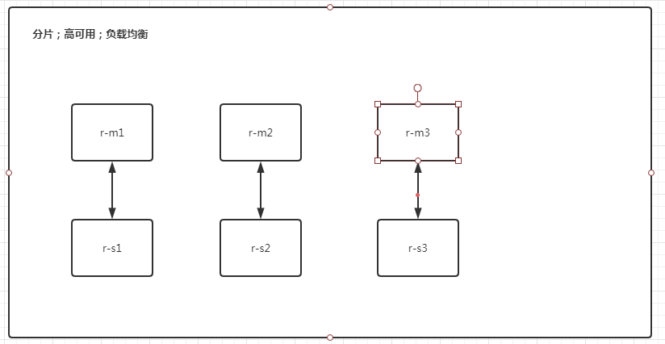


```shell
# 1.创建一个redis网卡
[root@iZm5e74mdg5903trjt1e17Z ~]# docker network create redis --subnet 172.38.0.0/16
9a10f2c6f2493ae61c4806d0ae95cc7cf7790d2eaf764642c61d9ed3e78eab88

# 2. 通过脚本创建六个redis的配置
for port in $(seq 1 6); \
do \
mkdir -p /mydata/redis/node-${port}/conf
cat << EOF >/mydata/redis/node-${port}/conf/redis.conf
port 6379
bind 0.0.0.0
cluster-enabled yes
cluster-config-file nodes.conf
cluster-node-timeout 5000
cluster-announce-ip 172.38.0.1${port}
cluster-announce-port 6379
cluster-announce-bus-port 16379
appendonly yes
EOF
done
 # for循环启动六个redis容器
for port in $(seq 1 6); \
do \
docker run -p 637${port}:6379 -p 1637${port}:16379 --name redis-${port} \
-v /mydata/redis/node-${port}/data:/data \
-v /mydata/redis/node-${port}/conf/redis.conf:/etc/redis/redis.conf \
-d --net redis --ip 172.38.0.1${port} redis:5.0.9-alpine3.11 redis-server /etc/redis/redis.conf
done


docker run -p 6371:6379 -p 16371:16379 --name redis-1 \
-v /mydata/redis/node-1/data:/data \
-v /mydata/redis/node-1/conf/redis.conf:/etc/redis/redis.conf \
-d --net redis --ip 172.38.0.11 redis:5.0.9-alpine3.11 redis-server /etc/redis/redis.conf

# 进入redis-1的容器内创建集群
[root@iZm5e74mdg5903trjt1e17Z redis]# docker exec -it redis-1 /bin/sh
# 创建集群
/data # redis-cli --cluster create 172.38.0.11:6379 172.38.0.12:6379 172.38.0.13:6379 172.38.0.14:6379 172.38.0.15:6379 172.38.0.16:6379 --cluster-replicas 1
>>> Performing hash slots allocation on 6 nodes...
Master[0] -> Slots 0 - 5460
Master[1] -> Slots 5461 - 10922
Master[2] -> Slots 10923 - 16383
Adding replica 172.38.0.15:6379 to 172.38.0.11:6379
Adding replica 172.38.0.16:6379 to 172.38.0.12:6379
Adding replica 172.38.0.14:6379 to 172.38.0.13:6379
M: 7692c06fb762868520fc0dd54766d1bff52cf954 172.38.0.11:6379
   slots:[0-5460] (5461 slots) master
M: 0302a02d70f17f14ff376677eca4871ee505bcfb 172.38.0.12:6379
   slots:[5461-10922] (5462 slots) master
M: 9c08682de28222c200efbc0cdb55d5b48fb6e907 172.38.0.13:6379
   slots:[10923-16383] (5461 slots) master
S: a0013cba4060781319db50f4dbd175990e07fdc3 172.38.0.14:6379
   replicates 9c08682de28222c200efbc0cdb55d5b48fb6e907
S: 88bd91cdb7fcd905fb0546399762afd1219cbdd3 172.38.0.15:6379
   replicates 7692c06fb762868520fc0dd54766d1bff52cf954
S: c4bb54439afc4e971e255d51248468e8a5bc7bbc 172.38.0.16:6379
   replicates 0302a02d70f17f14ff376677eca4871ee505bcfb
Can I set the above configuration? (type 'yes' to accept): yes
>>> Nodes configuration updated
>>> Assign a different config epoch to each node
>>> Sending CLUSTER MEET messages to join the cluster
Waiting for the cluster to join
...
>>> Performing Cluster Check (using node 172.38.0.11:6379)
M: 7692c06fb762868520fc0dd54766d1bff52cf954 172.38.0.11:6379
   slots:[0-5460] (5461 slots) master
   1 additional replica(s)
M: 0302a02d70f17f14ff376677eca4871ee505bcfb 172.38.0.12:6379
   slots:[5461-10922] (5462 slots) master
   1 additional replica(s)
S: 88bd91cdb7fcd905fb0546399762afd1219cbdd3 172.38.0.15:6379
   slots: (0 slots) slave
   replicates 7692c06fb762868520fc0dd54766d1bff52cf954
S: a0013cba4060781319db50f4dbd175990e07fdc3 172.38.0.14:6379
   slots: (0 slots) slave
   replicates 9c08682de28222c200efbc0cdb55d5b48fb6e907
S: c4bb54439afc4e971e255d51248468e8a5bc7bbc 172.38.0.16:6379
   slots: (0 slots) slave
   replicates 0302a02d70f17f14ff376677eca4871ee505bcfb
M: 9c08682de28222c200efbc0cdb55d5b48fb6e907 172.38.0.13:6379
   slots:[10923-16383] (5461 slots) master
   1 additional replica(s)
[OK] All nodes agree about slots configuration.
>>> Check for open slots...
>>> Check slots coverage...
[OK] All 16384 slots covered.

# 连接集群
/data # redis-cli -c
# 查看集群的节点
127.0.0.1:6379> cluster nodes
0302a02d70f17f14ff376677eca4871ee505bcfb 172.38.0.12:6379@16379 master - 0 1597739563012 2 connected 5461-10922
88bd91cdb7fcd905fb0546399762afd1219cbdd3 172.38.0.15:6379@16379 slave 7692c06fb762868520fc0dd54766d1bff52cf954 0 1597739563000 5 connected
a0013cba4060781319db50f4dbd175990e07fdc3 172.38.0.14:6379@16379 slave 9c08682de28222c200efbc0cdb55d5b48fb6e907 0 1597739564521 4 connected
c4bb54439afc4e971e255d51248468e8a5bc7bbc 172.38.0.16:6379@16379 slave 0302a02d70f17f14ff376677eca4871ee505bcfb 0 1597739563513 6 connected
9c08682de28222c200efbc0cdb55d5b48fb6e907 172.38.0.13:6379@16379 master - 0 1597739563000 3 connected 10923-16383
7692c06fb762868520fc0dd54766d1bff52cf954 172.38.0.11:6379@16379 myself,master - 0 1597739562000 1 connected 0-5460
```

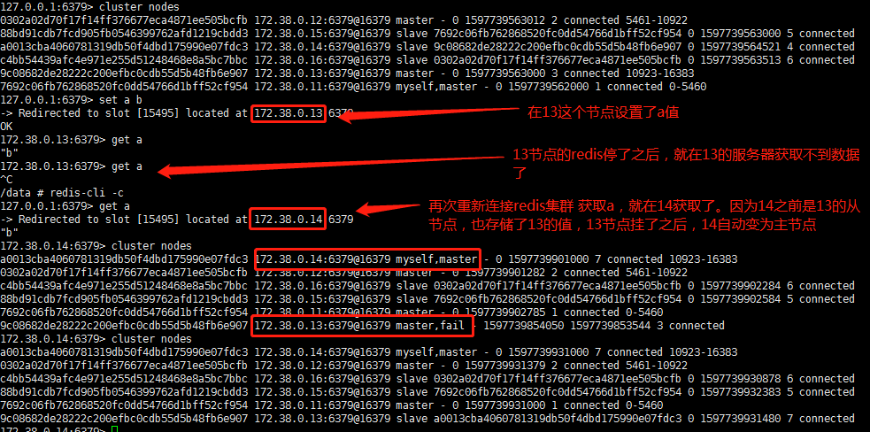


## SpringBoot 打包镜像

1. 构建springboot项目

```java
/**
 * @program: demo
 * @description: hello 测试
 * @author: Lijiat
 * @create: 2020-08-18 16:59
 */
@RestController
public class HelloController {

    @RequestMapping("/hello")
    public String hello(){
        return "hello ,Lijiat";
    }

```

2. 打包应用

3. 编写Dockerfile

```dockerfile
FROM java:8

COPY *.jar /app.jar

EXPOSE 8080

ENTRYPOINT ["java","-jar","/app.jar"]
```

4. 构建镜像

```shell
# 上传jar包和Dockerfile文件到服务器
# 构建镜像
[root@iZm5e74mdg5903trjt1e17Z idea]# ll
total 16140
-rw-r--r-- 1 root root 16519869 Aug 18 17:22 demo-0.0.1-SNAPSHOT.jar
-rw-r--r-- 1 root root       90 Aug 18 17:22 Dockerfile
[root@iZm5e74mdg5903trjt1e17Z idea]# docker build -t springboot-demo .
```

5. 发布运行

```shell
[root@iZm5e74mdg5903trjt1e17Z idea]# docker run -d -p 8060:8080 --name springboot-web springboot-demo
```


# Docker Compose

## 简介

Docker Compose 来轻松高效的管理容器。定义运行多个容器

> 官方介绍

定义，运行多个容器

YAML file 配置文件

single command。命令有哪些

Compose is a tool for defining and running multi-container Docker applications. With Compose, you use a YAML file to configure your application’s services. Then, with a single command, you create and start all the services from your configuration. To learn more about all the features of Compose, see [the list of features](https://docs.docker.com/compose/#features).

Compose works in all environments: production, staging, development, testing, as well as CI workflows. You can learn more about each case in [Common Use Cases](https://docs.docker.com/compose/#common-use-cases).

Using Compose is basically a three-step process:

**三步骤：**

1. Define your app’s environment with a **`Dockerfile`** so it can be reproduced anywhere.
   1. Dockerfile保证我们的项目在任何地方可以运行
2. Define the services that make up your app in `docker-compose.yml` so they can be run together in an isolated environment.
   1. services 什么是服务
   2. docker-compose.yml 这个文件怎么写
3. Run `docker-compose up` and Compose starts and runs your entire app.
   1. 启动项目

> Compose的理解

Compose是Docker官方的开源文档，需要安装

Dockerfile 让程序在任何地方运行

docker-compose.yml文件示例

```yml
version: '2.0'
services:
  web:
    build: .
    ports:
    - "5000:5000"
    volumes:
    - .:/code
    - logvolume01:/var/log
    links:
    - redis
  redis:
    image: redis
volumes:
  logvolume01: {}
```

Compose两个重要的概念

- 服务services：容器，应用（web，mysql，redis）
- 项目project：一组关联的容器。

## 安装

1、下载

```shell
# 官方的地址，特别慢
sudo curl -L "https://github.com/docker/compose/releases/download/1.26.2/docker-compose-$(uname -s)-$(uname -m)" -o /usr/local/bin/docker-compose

# 国内的镜像，会快点
sudo curl -L https://get.daocloud.io/docker/compose/releases/download/1.25.5/docker-compose-`uname -s`-`uname -m` > /usr/local/bin/docker-compose

# 权限赋值
[root@iZm5e74mdg5903trjt1e17Z bin]# chmod +x /usr/local/bin/docker-compose
```

## 体验

根据官方文档

https://docs.docker.com/compose/gettingstarted/

1、创建文件夹

```shell
$ mkdir composetest
$ cd composetest
```

2、创建一个app.py文件

```python
import time

import redis
from flask import Flask

app = Flask(__name__)
cache = redis.Redis(host='redis', port=6379)


def get_hit_count():
    retries = 5
    while True:
        try:
            return cache.incr('hits')
        except redis.exceptions.ConnectionError as exc:
            if retries == 0:
                raise exc
            retries -= 1
            time.sleep(0.5)


@app.route('/')
def hello():
    count = get_hit_count()
    return 'Hello World! I have been seen {} times.\n'.format(count)
```

3、创建requirements.txt文件，将python文件依赖的包写进去

```
flask
redis
```

4、创建Dockerfile文件

```dockerfile
FROM python:3.7-alpine
WORKDIR /code
ENV FLASK_APP app.py
ENV FLASK_RUN_HOST 0.0.0.0
RUN apk add --no-cache gcc musl-dev linux-headers
COPY requirements.txt requirements.txt
RUN pip install -r requirements.txt
EXPOSE 5000
COPY . .
CMD ["flask", "run"]
```

5、创建docker-compose.yml文件

```yml
version: '3'
services:
  web:
    build: .
    ports:
      - "5000:5000"
  redis:
    image: "redis:alpine"
```

6、构建并运行compose

```

```


# Docker Swarm


# CI/CD 之 Jenkins