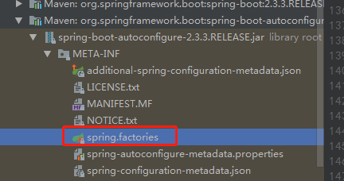

微服务的论文：https://www.cnblogs.com/justBobo/p/10661307.html

# 原理初探

**自动装配：**


**pom.xml**

- spring-boot-dependencies : 核心依赖在父工程中
- 我们在写或者引入一些Springboot依赖的时候，不需要指定版本，就因为有这些版本仓库


**启动器：**

- 启动器就是Springboot的启动场景,spring-boot-starter-*

- ```xml
          <dependency>
              <groupId>org.springframework.boot</groupId>
              <artifactId>spring-boot-starter-web</artifactId>
          </dependency>
  ```

- 比如spring-boot-starter-web，就会帮助我们自动导入web环境所有的依赖！

- springboot会把所有的功能场景，都变成一个个的启动器

- 如果我们需要一些功能，就只需要找到指定的启动器就可以了`starter`

- starter [官网](https://docs.spring.io/spring-boot/docs/current/reference/html/using-spring-boot.html#using-boot-starter)


**主程序**

```java
@SpringBootApplication
public class DemoApplication {

    public static void main(String[] args) {
        SpringApplication.run(DemoApplication.class, args);
    }

}
```

- 注解

  - ```java
    @SpringBootApplication	//标注这个类是一个springboot的应用，启动类下的所有资源被导入
    	@SpringBootConfiguration	//springboot的配置
    		@Configuration			//spring配置类
    			@Component			//说明这是spring的组件
    	@EnableAutoConfiguration	//自动配置
    		@AutoConfigurationPackage	//自动配置包
    			@Import({Registrar.class})	//自动配置`包注册`
    		@Import({AutoConfigurationImportSelector.class})	//自动配置导入选择
    
    
    ```

  - ```java
    //获取所有的配置  AutoConfigurationImportSelector
    List<String> configurations = this.getCandidateConfigurations(annotationMetadata, attributes);
    
    
    //获取候选的配置
    protected List<String> getCandidateConfigurations(AnnotationMetadata metadata, AnnotationAttributes attributes) {
            List<String> configurations = SpringFactoriesLoader.loadFactoryNames(this.getSpringFactoriesLoaderFactoryClass(), this.getBeanClassLoader());
            Assert.notEmpty(configurations, "No auto configuration classes found in META-INF/spring.factories. If you are using a custom packaging, make sure that file is correct.");
            return configurations;
        }
    
    
    //  META-INF/spring.factories   自动配置的核心文件
    ```

  - META-INF/spring.factories   自动配置的核心文件

  - 

- 结论：springboot的所有配置都是在启动的时候扫描并加载：spring.factories所有的自动配置类，都在这里面，但是不一定生效，要判断条件是否生效，只要导入对应的start，就有对应的启动器了，有了启动器，我们自动装配就会生效，然后就配置成功了。


1. springboot在启动的时候，从类路径下/MEAT-INF/spring.factories获取指定的值
2. 将这些自动配置的类导入容器，自动配置就会生效，帮我们进行自动配置！
3. 以前我们需要自动配置的东西，现在springboot帮我们做了！
4. 整合javaEE，解决方案和自动配置的东西在spring-boot-autoconfigure-2.3.3.RELEASE.jar这个包下
5. 它会把所有需要导入的组件，以类名的方式返回，这些组件就会被添加到容器
6. 容器中也会存在非常多的xxxAutoConfiguration的文件（@Bean）,就是这些类给容器中导入了这个场景需要的所有组件，并自动配置。
7. 有了自动配置类，省去我们手动编写配置文件的工作

## 解析spring.factories中的类

例：HttpEncodingAutoConfiguration

```java
//表示这是一个配置类
@Configuration(proxyBeanMethods = false)
//自动配置属性：
@EnableConfigurationProperties(ServerProperties.class)
//spring的底层注解，根据不同的条件来判断当前的配置或者类是否生效！
//@ConditionalOnWebApplication 当前是web环境
@ConditionalOnWebApplication(type = ConditionalOnWebApplication.Type.SERVLET)

//@ConditionalOnClass 系统中有指定的类
@ConditionalOnClass(CharacterEncodingFilter.class)
//@ConditionalOnProperty 系统中指定的属性是否有指定的值
@ConditionalOnProperty(prefix = "server.servlet.encoding", value = "enabled", matchIfMissing = true)
public class HttpEncodingAutoConfiguration {

	private final Encoding properties;

	public HttpEncodingAutoConfiguration(ServerProperties properties) {
		this.properties = properties.getServlet().getEncoding();
	}

	@Bean
	@ConditionalOnMissingBean
	public CharacterEncodingFilter characterEncodingFilter() {
		CharacterEncodingFilter filter = new OrderedCharacterEncodingFilter();
		filter.setEncoding(this.properties.getCharset().name());
		filter.setForceRequestEncoding(this.properties.shouldForce(Encoding.Type.REQUEST));
		filter.setForceResponseEncoding(this.properties.shouldForce(Encoding.Type.RESPONSE));
		return filter;
	}

	@Bean
	public LocaleCharsetMappingsCustomizer localeCharsetMappingsCustomizer() {
		return new LocaleCharsetMappingsCustomizer(this.properties);
	}

	static class LocaleCharsetMappingsCustomizer
			implements WebServerFactoryCustomizer<ConfigurableServletWebServerFactory>, Ordered {

		private final Encoding properties;

		LocaleCharsetMappingsCustomizer(Encoding properties) {
			this.properties = properties;
		}

		@Override
		public void customize(ConfigurableServletWebServerFactory factory) {
			if (this.properties.getMapping() != null) {
				factory.setLocaleCharsetMappings(this.properties.getMapping());
			}
		}

		@Override
		public int getOrder() {
			return 0;
		}

	}

}

```


```txt
@Conditional扩展注解 作用
@ConditionalOnJava 系统的java版本是否符合要求
@ConditionalOnBean 容器中存在指定Bean
@ConditionalOnMissingBean 容器中不存在指定Bean
@ConditionalOnExpression 满足SpEL表达式指定
@ConditionalOnClass 系统中有指定的类
@ConditionalOnMissingClass 系统中没有指定的类
@ConditionalOnSingleCandidate 容器中只有一个指定的Bean，或者这个Bean是首选Bean
@ConditionalOnProperty 系统中指定的属性是否有指定的值
@ConditionalOnResource 路径下是否存在指定资源文件
@ConditionalOnWebApplication 当前是web环境
@ConditionalOnNotWebApplication当前不是web环境
@ConditionalOnJndi JNDI存在指定项
```

我们在配置文件中能够配置的东西，都存在一个固有的规律。

都有一个xxxAutoConfiguration，这个配置类中会用到xxxProperties类，这个Properties类中的属性对应，配置文件中能够配置的属性。

## 自动装配的原理

1. SpringBoot启动会加载大量的自动配置类
2. 查看需要的功能能是否存在SpringBoot默认写好的自动配置类当中
3. 再查看自动配置类中到底配置了哪些组件
4. 给容器中自动配置类添加组件的时候，会从properties类中获取某些属性。我们只需要在配置文件中指定这些属性的值即可
5. xxxxAutoConfiguration：自动配置类，给容器中添加组件
6. xxxxProperties：封装配置文件中相关的属性。

## SpringApplication.run分析

> SpringApplication

这个类主要做了以下四件事情

1. 推断应用的类型是普通项目还是Web项目
2. 查找并加载所有可用初始化器，设置到initializers属性中
3. 找出所有的应用程序监听器，设置到listeners属性中
4. 推断并设置main方法的定义类，找到运行的主类

# 配置文件

application.yaml

```yaml
# 普通的key-val
name: zhang

# 对象
student:
  name: zhang
  age: 18

# 行内写法
student:{name: zhang,age: 3}


# 数组
pets:
  - cat
  - dog
  - pig

pets1: [cat,dog,pig]
```

1. yaml文件可以给实体类赋值

```java
@Component
@ConfigurationProperties(prefix = "person") //将ymal中的person的属性值复制给person
public class Person {
        private String name;

    private Integer age;

    private Boolean happy;

    private Date birth;

    private Map<String,Object> maps;

    private List<Object> lists;

    private Dog dog;
}


```

```yaml
person:
  name: zhang
  age: 3
  happy: false
  birth: 2019/11/02
  maps: {k1: v1,k2: v2}
  lists:
    - code
    - music
    - girl
  dog:
    name: wangcai
    age: 18
```

2. 指定配置文件给属性复制

```java
@PropertySource(value = "classpath:application.properties")
public class Person {

    @Value("${name}")
    private String name;
```

3. JSP303校验

```java
//校验name是否是邮箱格式

@Validated
public class Person {

    @Email
    private String name;
```


# SpringBoot Web开发


## 静态资源

```java
//静态资源可配置的路径
//"/webjars/**"
// 优先级一下四个从大到小
//"classpath:/META-INF/resources/"
//"classpath:/resources/", 
//"classpath:/static/",
//"classpath:/public/"


@Override
		public void addResourceHandlers(ResourceHandlerRegistry registry) {
            //如果已经自动配合
			if (!this.resourceProperties.isAddMappings()) {
				logger.debug("Default resource handling disabled");
				return;
			}
			Duration cachePeriod = this.resourceProperties.getCache().getPeriod();
			CacheControl cacheControl = this.resourceProperties.getCache().getCachecontrol().toHttpCacheControl();
            //
			if (!registry.hasMappingForPattern("/webjars/**")) {
				customizeResourceHandlerRegistration(registry.addResourceHandler("/webjars/**")
						.addResourceLocations("classpath:/META-INF/resources/webjars/")
						.setCachePeriod(getSeconds(cachePeriod)).setCacheControl(cacheControl));
			}
            //加载静态资源路径
			String staticPathPattern = this.mvcProperties.getStaticPathPattern();
			if (!registry.hasMappingForPattern(staticPathPattern)) {
				customizeResourceHandlerRegistration(registry.addResourceHandler(staticPathPattern)
						.addResourceLocations(getResourceLocations(this.resourceProperties.getStaticLocations()))
						.setCachePeriod(getSeconds(cachePeriod)).setCacheControl(cacheControl));
			}
		}


	//可识别的静态资源路径
	private static final String[] CLASSPATH_RESOURCE_LOCATIONS = { "classpath:/META-INF/resources/","classpath:/resources/", "classpath:/static/", "classpath:/public/" };
	/**
	 * Locations of static resources. Defaults to classpath:[/META-INF/resources/,
	 * /resources/, /static/, /public/].
	 */
	private String[] staticLocations = CLASSPATH_RESOURCE_LOCATIONS;
```

注：在template目录下的所有页面，只能通过controller来跳转。这个需要模板引擎的支持。


## 模板引擎

只要使用到了thymeleaf，只需要导入对应的依赖就可以了！我们将html放在我们的templates目录下

```java
public static final String DEFAULT_PREFIX = "classpath:/templates/";

public static final String DEFAULT_SUFFIX = ".html";
```

thymeleaf语法

```java
@RequestMapping("/test")
    public String index(Model model) {
        model.addAttribute("msg","<h1>hello,springboot</h1>");
        return "test";
    }
```


```html
<!--所有的html元素都可以被 thymeleaf替换接管  th:元素名-->
<!--th:text 获取字符串信息-->
<div th:text="${msg}"></div>
<!--th:utext 获取可转义的字符串信息-->
<div th:utext="${msg}"></div>
```

## 自动配置SpringMvc

https://blog.csdn.net/lizhiqiang1217/article/details/91355658

```java
/**
 * 如果，你想diy一些定制化的功能，只要写这个组件，然后将它交给springboot  springboot就会帮我们自动装配
 *
 * @program: demo
 * @description: mvcConfig
 * @author: zhangjialin
 * @create: 2020-08-26 11:35
 */
@Configuration
public class MyMvcConfig implements WebMvcConfigurer {

    /**
     * ViewResolver 实现了视图解析器接口的类，我们就可以
     * @return
     */
    @Bean
    public ViewResolver myViewResolver(){
        return new MyViewResolver();
    }

    /**
     * 自定义一个视图解析器 MyViewResolver
     */
    public static class MyViewResolver implements ViewResolver{
        @Override
        public View resolveViewName(String viewName, Locale locale) throws Exception {
            return null;
        }
    }
}
```

