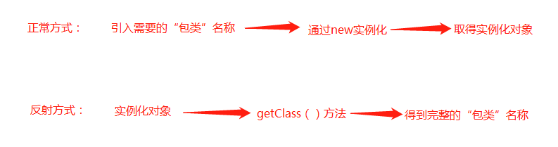

# 注解

## 什么是注解

Annotation的作用：

- 不是程序本身，可以对程序作为解释
- 可以被其他程序（比如：编译器）读取。

Annotation的格式：

- 注解是以“@注释名”在代码中存在的，还可以添加一些参数值，例如：@SuppressWarning（value="unchecked"）

Annotation在哪里使用：

- 可以附加在package，class，method，field等上面。相当于给他们添加了额外的辅助信息，我们可以通过反射机制编程实现对这些元数据的访问

## 内置注解

@Override：检查该方法是否是重写方法。如果发现其父类，或者是引用的接口中并没有该方法时，会报编译错误。

@Deprecated : 标记过时方法。如果使用该方法，会报编译警告。

@SuppressWarnings ： 指示编译器去忽略注解中声明的警告


## 元注解

@Retention：指示注释类型的注释要保留多久。如果注释类型声明中不存在 Retention 注释，则保留策略默认为 `RetentionPolicy.CLASS`。

@Documented：指示某一类型的注释将通过 javadoc 和类似的默认工具进行文档化。应使用此类型来注释这些类型的声明：其注释会影响由其客户端注释的元素的使用。如果类型声明是用 Documented 来注释的，则其注释将成为注释元素的公共 API 的一部分。

@Target ：

@Inherited：

```java
//Target 表示我们的注解可以用在哪些地方
@Target(value = {ElementType.METHOD,ElementType.TYPE})

// Retention  表示我们的注解在什么时候（源码，运行时。。。）还有效
@Retention(value = RetentionPolicy.RUNTIME)

//Documented 表示是否将我们的注解生成在Java Doc中
@Documented

//Inherited 子类可以继承父类的注解
@Inherited
/**
 * @program: demo
 * @description: 自定义注解
 * @author: zhangjialin
 * @create: 2020-08-19 10:46
 */
public @interface MyAnnotation{

}
```

注解定义参数

```java

public class Test01 {
    //注解可以显示赋值，如果没有默认值，我们必须给出注解赋值
    @MyAnnotation(name = "zhang",schools = {"zhang","jia"})
    public void tets(){

    }
}


@Target(value = {ElementType.METHOD,ElementType.TYPE})
@Retention(value = RetentionPolicy.RUNTIME)
@interface MyAnnotation{
    /**
     * 注解的参数 ： 参数类型+参数名()
     * @return
     */
    String name();
    int age() default 0;
    int id() default  -1;
    
    String[] schools() ;

}
```

# 反射 

## 反射的概念

Reflection（反射）是java呗视为动态语言的关键，反射机制允许程序在执行期间借助于Reflection API 取得任何类的内部信息，并能直接操作任意对象的内部属性及方法。

```java
Class c = Class.forName("java.lang.Stirng")
```

加载完类之后，在堆内存的方法区就会产生一个Class类型的对象（一个类只有一个Class对象），这个对象就包含完整的类的结构信息。我们可以通过对这个对象看到类的结构。这个对象就像一面镜子，透过这个镜子看到类的结构。所以，我们形象的称为：反射



## 获取class类的实例

1. 若已知具体的类，可以通过类的class属性获取，该方法最为安全可靠，程序性能最高

```java
Class clazz = Person.class;
```

2. 已知某个类的实例，调用该实例的getClass()方法获取Class对象

```java
Class clazz = person.getClass();
```

3. 已知一个类的全名，且在该类的类路径下，可通过Class类的静态方法forName()获取，可能抛出ClassNotFoundException

```java
Class c = Class.forName("demo01.Student")
```

4. 内置基本数据类型可以直接用类名.Type
5. 还可以使用ClassLoader


## 获取类运行时的结构

```java
public class Test02 {
    public static void main(String[] args) throws ClassNotFoundException, NoSuchFieldException, NoSuchMethodException {

        Class c1 = Class.forName("com.example.demo.reflection.User");


        System.out.println("===============获取类的名字==================");
        //获取包名和类名
        System.out.println(c1.getName());
        //获取类名
        System.out.println(c1.getSimpleName());

        System.out.println("===============获取类的属性==================");
        //获取类的public属性
        Field[] fields = c1.getFields();
        for (Field field : fields) {
            System.out.println("c1.getFields():"+field);
        }

        //获取类的所有属性
        fields = c1.getDeclaredFields();
        for (Field field : fields) {
            System.out.println("c1.getDeclaredFields():"+field);
        }
        //获取指定属性
        Field name = c1.getDeclaredField("name");
        System.out.println("c1.getDeclaredField(\"name\"):"+name);


        System.out.println("===============获取类的方法==================");
        //正常获取 获取类的public和父类的public方法
        Method[] methods = c1.getMethods();
        for (Method method : methods) {
            System.out.println("c1.getMethods():"+method);
        }

        //获取本类的所有方法
        methods = c1.getDeclaredMethods();
        for (Method method : methods) {
            System.out.println("c1.getDeclaredMethods():"+method);
        }

        //获取指定的方法
        Method getName = c1.getDeclaredMethod("getName",null);
        System.out.println("c1.getDeclaredMethod(\"getName\",null):"+getName);

        System.out.println("===============获取类的构造器==================");
        Constructor[] constructors = c1.getConstructors();
        for (Constructor constructor : constructors) {
            System.out.println(constructor);
        }
    }
}
```

## 动态对象的创建

```java
        //获取class对象
        Class c1 = Class.forName("com.example.demo.reflection.User");
        //通过newInstance创建对象，本质上是调用类的无参构造函数
        User user = (User)c1.newInstance();
        System.out.println(user);

        //通过构造器创建对象
        Constructor constructor = c1.getDeclaredConstructor(String.class,int.class,int.class);
        User user1 = (User) constructor.newInstance("zhang",1,18);
        System.out.println(user1);

        //通过反射调用普通方法
        User user2 = (User)c1.newInstance();
        //通过反射获取一个方法
        Method setName = c1.getDeclaredMethod("setName", String.class);
        setName.invoke(user2,"Lijiatu");
        System.out.println(user2.getName());
```

## 通过反射获取泛型

```java
public class Test05 {

    public void test01(Map<String,User> map, List<User> list){
        System.out.println("test02");
    }

    public Map<String,User> test02(){
        System.out.println("test02");
        return null;
    }
    public static void main(String[] args) throws NoSuchMethodException {
        Method method = Test05.class.getMethod("test01", Map.class, List.class);

        //获取方法的参数类型
        Type[] genericParameterTypes = method.getGenericParameterTypes();
        for (Type genericParameterType : genericParameterTypes) {
            //打印test01参数的类型
            System.out.println("参数类型："+genericParameterType);

            if(genericParameterType instanceof ParameterizedType){
                Type[] actualTypeArguments = ((ParameterizedType) genericParameterType).getActualTypeArguments();
                for (Type actualTypeArgument : actualTypeArguments) {
                    //打印带有泛型的参数的泛型
                    System.out.println("泛型类型："+actualTypeArgument);
                }
            }
        }

        method = Test05.class.getMethod("test02",null);
        Type genericReturnType = method.getGenericReturnType();
        if(genericReturnType instanceof ParameterizedType){
            Type[] actualTypeArguments = ((ParameterizedType) genericReturnType).getActualTypeArguments();
            for (Type actualTypeArgument : actualTypeArguments) {
                System.out.println(actualTypeArgument);
            }
        }
    }
}
```

## 反射操作注解

```java
/**
 * @program: demo
 * @description: 反射操作注解
 * @author: zhangjialin
 * @create: 2020-08-19 18:36
 */
public class Test06 {
    public static void main(String[] args) throws ClassNotFoundException, NoSuchFieldException {
        Class t1 = Class.forName("com.example.demo.reflection.Student");

        //通过反射获得注解
        Annotation[] annotations = t1.getAnnotations();
        for (Annotation annotation : annotations) {
            System.out.println(annotation);
        }

        //获取注解的value值
        TableInfo tableInfo = (TableInfo)t1.getAnnotation(TableInfo.class);
        System.out.println(tableInfo.value());

        //获得类指定的注解
        Field field = t1.getDeclaredField("id");
        ColumnInfo columnInfo = field.getAnnotation(ColumnInfo.class);
        System.out.println(columnInfo.columnName());
        System.out.println(columnInfo.type());
        System.out.println(columnInfo.length());
    }
}

@TableInfo(value = "db_student")
class Student{
    @ColumnInfo(columnName = "db_id",type = "int",length = 10)
    private int id;

    @ColumnInfo(columnName = "db_name",type = "int",length = 10)
    private String name;

    @ColumnInfo(columnName = "db_age",type = "varchar",length = 10)
    private int age;

    public Student(int id, String name, int age) {
        this.id = id;
        this.name = name;
        this.age = age;
    }

    public int getId() {
        return id;
    }

    public void setId(int id) {
        this.id = id;
    }

    public String getName() {
        return name;
    }

    public void setName(String name) {
        this.name = name;
    }

    public int getAge() {
        return age;
    }

    public void setAge(int age) {
        this.age = age;
    }
}

@Target(value = ElementType.TYPE)
@Retention(value = RetentionPolicy.RUNTIME)
@interface TableInfo{
    String value();
}
@Target(value = ElementType.FIELD)
@Retention(value = RetentionPolicy.RUNTIME)
@interface ColumnInfo{
    String columnName();

    String type();

    int length();
}

```


